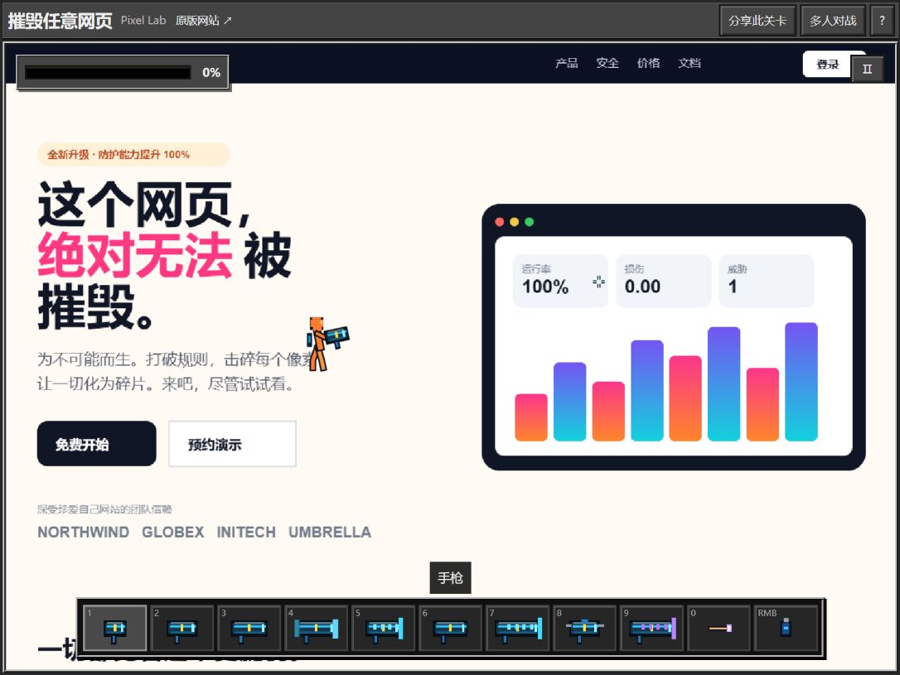
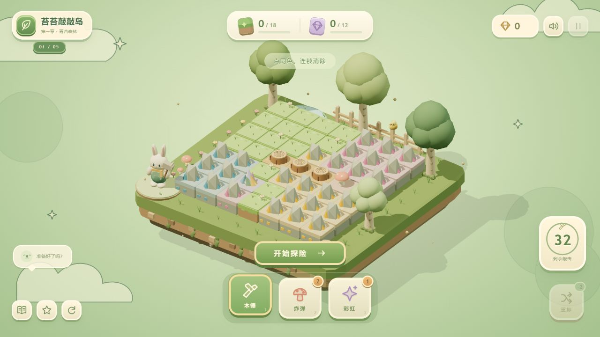
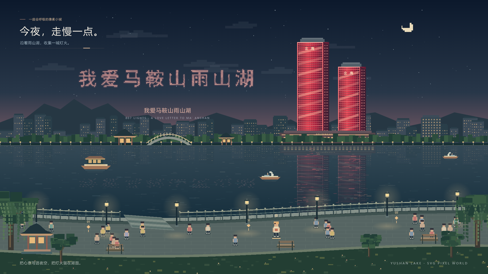

# AI_GTA

AI 生成的游戏向 Web 项目集合。每个项目独立目录存放。

**🎮 在线试玩（GitHub Pages）：<https://shfzhangjian.github.io/AI_GTA/>**

## 项目索引

| 目录 | 说明 | 技术栈 | 在线试玩 |
| --- | --- | --- | --- |
| [`pixel-destroy-lab/`](./pixel-destroy-lab/) | **摧毁任意网页 · Pixel Lab**：简体中文像素网页破坏沙盒，内置演示与维基百科示例、公开网页截图关卡、十种武器、飞行与手雷、最多四人房间对战，支持键鼠和触屏操作 | React 19 + Vinext / Vite 8 + Canvas 2D + Cloudflare Workers / D1 / R2（需要编译及后端服务） | [💻 本地启动说明](./pixel-destroy-lab/README.md#本地运行) |
| [`moss-mallet/`](./moss-mallet/) | **苔苔敲敲岛 · Moss & Mallet**：可爱等角 3D 森林浮岛、小兔矿工挥锤、相邻同类连锁开采、蘑菇范围爆破与彩虹全岛消除、特殊砖接力、五关收集目标；全屏游戏 HUD、手机横竖屏与双指缩放、原创合成音效和森林旋律 | HTML + Three.js r165 + SVG + WebAudio（本地依赖、零构建、无外部素材请求） | [🕹️ 立即开玩](https://shfzhangjian.github.io/AI_GTA/moss-mallet/) |
| [`shanghai-bund/`](./shanghai-bund/) | **漫步外滩**：上海外滩像素漫步、四座陆家嘴地标、上海时间同步钟楼、昼夜与雨晴切换、撑伞人流、黄浦江游船与倒影；309 灯点无人机演绎「我 ♥ 上海」、东方明珠和「外滩 · 晚安」，四处观景打卡 | 原生 JavaScript + SVG + WebAudio（零运行依赖、零构建） | [🕹️ 沿江漫步](https://shfzhangjian.github.io/AI_GTA/shanghai-bund/) |
| [`yushan-lake-pixel/`](./yushan-lake-pixel/) | **雨山湖夜游**：马鞍山金鹰红色双塔、湖面倒影与湖岸漫步；807 灯点无人机演绎“我爱马鞍山雨山湖”、爱心与双塔；昼夜、雨伞人流、游船、烟花、印记收集，支持 PNG / SVG 截图与 1080p MP4 导出 | 原生 JavaScript + SVG + WebAudio（零运行依赖、零构建） | [🕹️ 湖畔漫步](https://shfzhangjian.github.io/AI_GTA/yushan-lake-pixel/) · [🎬 成片](https://shfzhangjian.github.io/AI_GTA/yushan-lake-pixel/film.html) |
| [`tilt-ball/`](./tilt-ball/) | **Tilt Lab 倾斜实验室**：倾斜球台物理闯关，木板 / 冰面 / 毛毡各一关，程序纹理与随机金属陶瓷小球，真实接球洞下落，键盘与手机摇杆 | HTML + Three.js 0.180 + Rapier 3D + Vite（源码与相对路径 dist/ 一并提交） | [🕹️ 立即开玩](https://shfzhangjian.github.io/AI_GTA/tilt-ball/dist/) |
| [`breakout/`](./breakout/) | **砖块破坏者**：元素级砖块自由建模（7 种材质独立破坏物理）、连锁爆炸、顶部随机英文单词砖、掉落道具（多球/挡板伸缩/火球+子弹）、连击积分、WebAudio 合成音效、调试模式事件追踪 | HTML5 Canvas 2D + 原生 ES Module + WebAudio，零依赖、零素材文件 | [🕹️ 立即开玩](https://shfzhangjian.github.io/AI_GTA/breakout/) |
| [`low-poly-city/`](./low-poly-city/) | **低多边形等距城市 + 第一人称武器沙盒**（锤子/冲锋枪/狙击枪/火箭筒，NPC 生态与碰撞） | HTML + Three.js r165（原生 ES Module，零构建、离线可跑） | [🕹️ 立即开玩](https://shfzhangjian.github.io/AI_GTA/low-poly-city/) |
| [`zelda-like/`](./zelda-like/) | **塞尔达风格开放世界动作游戏**：随机刷怪、武器拾取（树枝/火炬/刀/弓/火焰连弓/石头）、营火点枝成火炬、扇面攻击+自动锁敌+血条、鼠标瞄准、怪物先手硬直、WebAudio 合成音效、小地图与 L 键调试面板 | HTML + Three.js 0.160（原生 ES Module，零构建） | [🕹️ 立即开玩](https://shfzhangjian.github.io/AI_GTA/zelda-like/) |
| [`huluwa-save-grandpa/`](./huluwa-save-grandpa/) | **葫芦娃救爷爷**：水墨弓阵防守、免费精灵素材、葫芦娃技能养成、洞府封印、虚线落点预览、低抛物线射击、WebAudio 合成音效 | HTML + Three.js r165（原生 ES Module，零构建） | [🕹️ 立即开玩](https://shfzhangjian.github.io/AI_GTA/huluwa-save-grandpa/) |
| [`three-viewer/`](./three-viewer/) | **UAL 动作角色 · 动作游戏控制演示**：WASD 走 / Shift 跑 / 空格蓄力跳（含腾空移动）/ K 组合拳连段 / J 魔法弹道，43 段动画姿态分组浏览，GLB 骨骼动画状态机 | HTML + Three.js r185（原生 ES Module，零构建） | [🕹️ 立即开玩](https://shfzhangjian.github.io/AI_GTA/three-viewer/) |
| [`space-shooter/`](./space-shooter/) | **Space Rage 六边形星域空战**：竖版打飞机、波次编队与旋转水雷、每 5 波多阶段 Boss、连击倍率（最高 ×8）、强化掉落（等离子炮/速射/修甲）、屏幕震动与死亡慢镜、WebAudio 合成音效与动态配乐、Three.js + KayKit 六边形无限滚动地表 | HTML + Three.js 0.169 + Canvas 2D（原生 ES Module，零构建） | [🕹️ 立即开玩](https://shfzhangjian.github.io/AI_GTA/space-shooter/) |
| [`billiards-3d/`](./billiards-3d/) | **3D 台球**：真实比例球桌（球径 63.5mm、台面 2.375m×1.155m）、480Hz 子步弹性碰撞物理、鼠标瞄准+蓄力击球、幽灵球落点预测、几何 AI 对手（假想接触点求解+路径遮挡）、落袋/库边/击球/犯规 WebAudio 程序化音效、你 vs 电脑回合制清台赛 | HTML + Three.js r165（原生 ES Module，零构建、音效全程序合成零素材） | [🕹️ 立即开玩](https://shfzhangjian.github.io/AI_GTA/billiards-3d/) |
| [`gomoku-threejs/`](./gomoku-threejs/) | **手绘五子棋**：动物/植物随机角色棋子、手机平面棋盘、吃子爆炸消除、提示推荐与危险提醒、攻击按钮赶走对方角色、飞机投弹破坏棋盘、胜利烟花与小人庆祝 | HTML + Three.js 0.164 + WebAudio（原生 ES Module，零构建） | [🕹️ 立即开玩](https://shfzhangjian.github.io/AI_GTA/gomoku-threejs/) |
| [`auto-factory/`](./auto-factory/) | **汽车智慧工厂数字孪生可视化大屏**：厂区五大车间三维全景 + 车间室内一镜到底进入；冲压滑块往复/焊装机器人集群+焊花粒子/涂装连续输送/总装合装岛升降四条产线动画、AGV 环线与跨车间物流光带、五大监控面板（工厂总览/经营概况/生产概况/车间概况/设备概况）+ ECharts 实时联动、设备点选监管浮窗与故障告警 | HTML + Three.js 0.160 + ECharts 5.5（原生 ES Module，零构建；three/echarts 走 CDN 需联网） | [🕹️ 立即体验](https://shfzhangjian.github.io/AI_GTA/auto-factory/) |
| [`sketch-wave-racer/`](./sketch-wave-racer/dist/) | **简笔画浪速赛艇**：第三人称 3D 水上赛艇——手绘卡通简笔画世界 + 高质感动态水面（多层波/菲涅耳反射/泡沫/水花粒子）；转速定命运的起步玩法（绿区完美弹射 / 轰过爆缸线爆缸熄火）、3 圈 10 检查点、漂移蓄力小加速、6 道具 + 3 AI 对手、飞鱼障碍、程序化赛道生成、卡通转速表、中英双语、本地最佳纪录、音效全 WebAudio 程序合成 | Three.js 0.169 + Vite 5（发布编译产物 dist/；npm test 61 项 headless 断言；全资产程序化原创零素材） | [🕹️ 立即开玩](https://shfzhangjian.github.io/AI_GTA/sketch-wave-racer/dist/) |
| [`cartoon-brawler/`](./cartoon-brawler/dist/) | **Tinker's Crossing 卡通格斗**：卡通中世纪 3D 清版动作——城堡门→村道→广场→木桥→Boss 竞技场一镜到底连续关卡；剑/锤双武器三段连击、刀剑客/蛮兵/游勇 3 种敌人 + 三阶段 Boss（6 加权随机技能）、受击停顿/镜头震动/武器拖痕/击退浮空倒地、包围圈围攻 AI（攻击槽位 + 效用评分）、可破坏场景（板条箱/桶/栅栏/桌/椅/车，碎块池硬上限）、固定步长物理 + 可变渲染帧、零素材全程序回退 | TypeScript(strict) + Vite 8 + Three.js 0.185 + Rapier3D（发布自包含 dist/ 相对 base；tsc --noEmit 严格零错误；soldier.glb 为 three.js MIT 示例，其余全程序生成） | [🕹️ 立即开玩](https://shfzhangjian.github.io/AI_GTA/cartoon-brawler/dist/) |
| [`underwater-explorer/`](./underwater-explorer/) | **Underwater Explorer 海底探索**：潜水员戴夫风格 2D/2.5D 海底探索原型，包含潜水员惯性移动、昼夜水面、氧气/生命 HUD、鱼群逃离、鱼叉瞄准蓄力发射、水底大气泡和海底装饰 | TypeScript(strict) + Vite 5 + Three.js 0.186（发布编译产物直接放在 underwater-explorer/；three 通过 CDN importmap 加载） | [🕹️ 立即开玩](https://shfzhangjian.github.io/AI_GTA/underwater-explorer/) |
| [`threejs-pirate-planet/`](./threejs-pirate-planet/dist/) | **微缩航海星球**：马里奥银河式球形小星球沙盒——球形地表（陆地/海洋/云层/大气/星空）+ Kenney Pirate Kit 全模型；港口城堡（方形城墙/角楼/大门/要塞）、球面弧线航线与船只（吃水/姿态对齐/海战炮击）、渡轮摆渡（每次载 5 人跨港）、小人漫游 + 方块宠物跟随、防重叠占位系统、环境事件与伤害系统、WebAudio 程序音效、lil-gui 调试面板 | Three.js 0.180 + Vite 5 + GSAP + lil-gui（发布编译产物 dist/ 含全部模型资源；node scripts 单元/静态检查 93+ 项断言；Kenney 海盗素材 CC0） | [🕹️ 立即开玩](https://shfzhangjian.github.io/AI_GTA/threejs-pirate-planet/dist/) |

项目由 **AI 辅助生成、迭代与验证**。已有项目包含 `unsloth/Qwen3.8-Flash-Next-GGUF` / DeepSeek Harness 工作流，Tilt Lab、雨山湖夜游和漫步外滩由 Codex 协助开发；具体实现与使用方式见各自文档：

- pixel-destroy-lab → [源码、操作与本地启动说明](./pixel-destroy-lab/README.md)
- shanghai-bund → [源码与操作说明](./shanghai-bund/README.md)

- breakout → [breakout/CODE_INTRO.md](./breakout/CODE_INTRO.md)
- moss-mallet → [moss-mallet/README.md](./moss-mallet/README.md)（由 Codex 协助开发）
- low-poly-city → [low-poly-city/README.md](./low-poly-city/README.md)
- zelda-like → [zelda-like/README.md](./zelda-like/README.md)
- huluwa-save-grandpa → [huluwa-save-grandpa/README.md](./huluwa-save-grandpa/README.md)
- three-viewer → [three-viewer/README.md](./three-viewer/README.md)
- space-shooter → [space-shooter/README.md](./space-shooter/README.md)
- billiards-3d → [billiards-3d/README.md](./billiards-3d/README.md)
- gomoku-threejs → [gomoku-threejs/README.md](./gomoku-threejs/README.md)
- auto-factory → [auto-factory/README.md](./auto-factory/README.md)
- sketch-wave-racer → 编译产物发布在 [sketch-wave-racer/dist/](./sketch-wave-racer/dist/)（开发文档见本地工作区源码目录）
- underwater-explorer → 编译产物发布在 [underwater-explorer/](./underwater-explorer/)（源码归档见 [underwater-explorer-src/](./underwater-explorer-src/)）
- threejs-pirate-planet → 编译产物发布在 [threejs-pirate-planet/dist/](./threejs-pirate-planet/dist/)
- cartoon-brawler → [cartoon-brawler/README.md](./cartoon-brawler/README.md)

- tilt-ball → [tilt-ball/README.md](./tilt-ball/README.md)（由 Codex 协助开发）

- yushan-lake-pixel → [项目说明](./yushan-lake-pixel/README.md) · [配套博文](./yushan-lake-pixel/exports/博文-把雨山湖的夜色做成像素游戏.txt)

## 本地运行

```bash
# 摧毁任意网页（Node.js >= 22.13，需后端服务）
cd pixel-destroy-lab
npm ci
npm run build
# 首次启动前，按该目录 README 的两条命令初始化本地数据库
npm start -- --port 8787

# 苔苔敲敲岛（零构建，http://localhost:8788；Windows 也可双击 start-game.cmd）
cd moss-mallet && npm start

# 漫步外滩（无构建、无运行依赖）
cd shanghai-bund && npm start

# 雨山湖夜游（无构建、无运行依赖）
cd yushan-lake-pixel && npm start

# 砖块破坏者（推荐 start.bat，自动开浏览器）
cd breakout && python -m http.server 8765

# 低多边形城市
cd low-poly-city && npx serve .

# 塞尔达风格开放世界
cd zelda-like && python3 -m http.server 8080

# 葫芦娃救爷爷
cd huluwa-save-grandpa && python3 -m http.server 8080

# Space Rage 六边形星域空战
cd space-shooter && python3 -m http.server 8080

# 3D 台球
cd billiards-3d && node serve.js   # 或 python -m http.server 8765

# 手绘五子棋
cd gomoku-threejs && python3 -m http.server 8080

# 汽车智慧工厂数字孪生大屏
cd auto-factory && python3 -m http.server 8080


# Underwater Explorer 海底探索（发布版直接打开；源码开发用 npm install && npm run dev）
cd underwater-explorer && python3 -m http.server 8080

# 简笔画浪速赛艇（构建版直接开玩；源码开发用 npm install && npm run dev）
cd sketch-wave-racer/dist && python3 -m http.server 8080
```

> 使用 ES Module + fetch 的项目需要 HTTP 环境。漫步外滩和雨山湖夜游支持直接打开各自目录中的 `index.html`；自动化验证和视频导出需启动本地服务。

## 摧毁任意网页 · Pixel Lab

把网页变成可破坏的像素关卡：十种武器、跳跃飞行、手雷和最多四人的房间对战。内置演示可直接体验；输入公开网址后，服务端通过 thum.io 获取截图并生成关卡。

- 本地地址：<http://127.0.0.1:8787/>。Windows 完成首次安装与数据库初始化后，可双击 `pixel-destroy-lab/启动游戏.cmd`。
- 操作：A / D 或方向键移动，空格跳跃或长按飞行，鼠标射击，右键手雷，数字键切换武器，Esc 暂停；手机提供触屏按钮。
- 已验证：生产编译、类型检查、浏览器进入内置演示，以及本地房间创建、状态同步和退出。
- [完整安装与启动说明](./pixel-destroy-lab/README.md#本地运行) · [验证记录](./pixel-destroy-lab/docs/VERIFICATION.md) · [素材来源与版本差异](./pixel-destroy-lab/docs/PARITY.md)



## 漫步外滩 · 云端来信

把上海外滩做成一个可以自由散步的像素世界：江海关钟楼与画面上的上海时间逐秒同步，东方明珠、上海中心、环球金融中心和金茂大厦轮廓可辨；游船、行人、烟花、灯光与江面倒影持续变化。

- 无人机编队循环演绎「我 ♥ 上海」→ 东方明珠与江水轮廓 →「外滩 · 晚安」，每幕停留 9 秒、换阵 5 秒，底部开关可独立控制。
- 方向键 / WASD / 点击步道自由漫步，按 E 收藏四处观景点；手机提供触屏方向键，进度保存在当前浏览器。
- 可切换昼夜、雨晴、人流、烟花、灯光秀、无人机与环境音效；雨天人物撑伞，江面出现涟漪。
- 游戏场景全部由 SVG 动态绘制，环境音效由 WebAudio 合成，无需安装依赖或构建。

[在线试玩](https://shfzhangjian.github.io/AI_GTA/shanghai-bund/) · [源码与启动说明](./shanghai-bund/README.md)


## GitHub Pages 部署方式

仓库根目录 `index.html` 为导航落地页；Pages 采用 **Deploy from a branch → `main` / (root)**。上表提供 GitHub Pages 试玩链接的项目可按对应路径访问；需要构建的静态项目已随仓库提交发布产物。

`pixel-destroy-lab/` 提供完整源码，需要编译后启动本地 Wrangler 服务，或部署至 Cloudflare Workers。它的房间数据库和网页截图 API 无法由 GitHub Pages 静态托管运行，启动方法见该项目 README。

## 苔苔敲敲岛 · 连锁开采

点击相邻同类矿块，一锤连消；连消 5 块奖励蘑菇炸弹，8 块再送彩虹魔法。收齐青苔与晶石，探索五种主题小岛。支持手机触摸、双指缩放与放大后拖动，桌面可用 1 / 2 / 3 选择道具、P 暂停、M 静音。

- [在线试玩](https://shfzhangjian.github.io/AI_GTA/moss-mallet/) · [操作与源码说明](./moss-mallet/README.md)
- 检查：在 `moss-mallet/` 运行 `npm test`，覆盖四向连消、工具优先级、特殊砖接力及 500 轮随机消除后的棋盘完整性。



## Tilt Lab 倾斜实验室开发

进入 tilt-ball 目录，运行 npm ci 和 npm run dev；构建运行 npm run build，物理验证运行 node tools/verify-goal.mjs。dist/ 已提交，可直接通过 GitHub Pages 试玩，详细说明见 [项目 README](./tilt-ball/README.md)。

## 雨山湖夜游 · 无人机告白

保留金鹰双塔的红色灯光，使用动态 SVG 绘制标题、湖岸、人流、游船、无人机与湖面倒影。支持方向键 / WASD / 点击步道漫步，以及手机方向控制。

- [源码与操作说明](./yushan-lake-pixel/README.md)
- [48 秒 1080p MP4 成片](./yushan-lake-pixel/exports/雨山湖夜游-无人机告白.mp4)（24 fps，H.264 / AAC，原创合成环境音乐）
- [博文](./yushan-lake-pixel/exports/博文-把雨山湖的夜色做成像素游戏.txt) · [高清截图](./yushan-lake-pixel/exports/夜空告白.png) · [SVG 矢量截图](./yushan-lake-pixel/exports/夜空告白.svg)


