# AI_GTA

AI 生成的游戏与交互动画项目集合。每个项目独立目录存放。

**🎮 在线试玩（GitHub Pages）：<https://shfzhangjian.github.io/AI_GTA/>**

## 项目索引

| 目录 | 说明 | 技术栈 | 在线试玩 |
| --- | --- | --- | --- |
| [`starbloom/`](./starbloom/) | **星环漫游 · STARBLOOM**：原创 3D 球面重力射击肉鸽，五种小星球、每球三波敌人、八项可叠加强化、彗星冲刺与星际跳跃；14 种原创音效、5 种星球环境音与独立音量控制；支持键鼠与触屏，附中文介绍视频和实机截图 | HTML + Three.js + 原生 ES Module + WebAudio（本地依赖、零构建、无需后端） | [✦ 开始航程](https://shfzhangjian.github.io/AI_GTA/starbloom/) · [🎬 视频与博文](https://shfzhangjian.github.io/AI_GTA/starbloom/blog.html) |
| [`huicheng-residence/`](./huicheng-residence/) | **汇成上东 · 空间档案**：按户型图与实拍重建 11 个空间，平面图、3D 总览、室内游走和 12 个导览视点；还原餐厨、卧室、书房、卫生间及入户门，支持门扇交互、碰撞、墙面材质与 PNG 导出 | HTML + Three.js 0.185.1（源码与单文件内嵌页面；运行零构建、无外部资源请求） | [🏠 走进空间](https://shfzhangjian.github.io/AI_GTA/huicheng-residence/) |
| [`digit-recognition/`](./digit-recognition/) | **一笔，如何成为一个数字**：77 秒全屏科普动画，以手写 0–9 展示像素采样、二值化、卷积、三维特征分层、池化和分类计算；支持暂停、分步、拖动进度、调速与全屏 | HTML + SVG + Three.js 0.185.1（本地依赖；含离线单文件版；需 WebGL 2） | [▶ 观看动画](https://shfzhangjian.github.io/AI_GTA/digit-recognition/) |
| [`relic-hunters/`](./relic-hunters/) | **遗物猎场 · RELIC FIELD**：废墟寻宝主题的等距像素动作肉鸽，10 名角色、24 把武器、40 件遗物、8 种补给、六系组合、9 个房间与 3 位 Boss；手动攻击、闪避、技能、随机奖励和永久收藏图鉴，支持键鼠与触屏 | HTML + 原生 ES Module + Canvas 2D + WebAudio（本地八方向像素素材、零运行依赖、零构建） | [◇ 进入遗迹](https://shfzhangjian.github.io/AI_GTA/relic-hunters/) |
| [`neon-breakout/`](./neon-breakout/) | **霓城突围**：中文 3D 跑酷射击，三位中文英雄、六章闯关、增益门、武器升级、巨型首领与无尽挑战；卷发连帽衫主角和破衣绿色怪物，支持键盘与手机触屏 | HTML + Three.js + 原生 ES Module + WebAudio（本地依赖、零构建、无需外部素材服务） | [⚡ 开始突围](https://shfzhangjian.github.io/AI_GTA/neon-breakout/) |
| [`sunfall/`](./sunfall/) | **落日协议 · SUNFALL**：1 名玩家与 11 名 AI 对手的 3D 海岛大逃杀，空降、搜刮装备、三类枪械、风暴安全区、AI 寻路与交战，支持键鼠和触屏 | HTML + Three.js r180 + 原生 ES Module + WebAudio（零构建；Python 本地服务；角色首次从官方来源获取） | [🪂 本地启动说明](./sunfall/README.md#本地启动) |
| [`leaflight/`](./leaflight/) | **叶间微光 · Leaflight**：等角像素森林冒险，叶帽小精灵收集 12 颗星露、躲避暗影菇并返回树心祭坛；点击寻路、无敌冲刺与眩晕、三格生命、暂停和重开，支持手机触屏 | HTML + 原生 JavaScript + Canvas 2D + WebAudio（零依赖、零构建、本地精灵素材） | [🌱 进入森林](https://shfzhangjian.github.io/AI_GTA/leaflight/) |
| [`cube-atelier/`](./cube-atelier/) | **魔方实验室 · Cube Atelier**：交互式三阶魔方、10 / 20 / 30 步打乱、人工转动、当前状态逐步还原指导与转错后重新规划、同步六面展开图、六组公式独立演示、撤销重做与练习保存，支持桌面和手机 | HTML + Three.js 0.185.1 + cubejs Worker（本地依赖、零构建、无外部资源请求） | [🧩 开始练习](https://shfzhangjian.github.io/AI_GTA/cube-atelier/) |
| [`tropical-island/`](./tropical-island/) | **潮屿 · TIDELANDS**：云海中的热带浮岛，恐龙头骨瀑布、肋骨珊瑚庭、木屋栈桥、棕榈林和火山；驾驶小船收集 8 颗珍珠、修复 4 处地标，支持自动绕岛寻路、昼夜、拍照、声音、存档和手机操作 | HTML + Three.js 0.185.1 + 自定义 GLSL + WebAudio（本地依赖、零构建、无远程素材请求） | [🏝️ 启航探索](https://shfzhangjian.github.io/AI_GTA/tropical-island/) |
| [`citrus-jelly/`](./citrus-jelly/) | **柑橘果冻 · Citrus Jelly**：半透明软糖柑橘树，局部弯曲与回弹、28 枚双向耦合悬果、摇晃掉落、摘取与投掷、碰撞与休眠、空茎再生；三组配色、硬度、阻尼、成熟度，手机横竖屏折叠面板 | 单文件 HTML + 原生 WebGPU / WGSL + 固定步长位置约束物理（零依赖、零构建、无外部资源请求，需支持 WebGPU） | [🍊 立即体验](https://shfzhangjian.github.io/AI_GTA/citrus-jelly/) |
| [`jelly-dice/`](./jelly-dice/) | **果冻骰子 · Jelly Dice**：可抓取、拉伸与轻戳的半透明软糖骰子，1–5 枚掷骰与点数结算、六种糖果色、玻璃托盘、分层折射与柔和阴影；软硬度、摇晃衰减、慢动作与晶格显示，支持触摸和键盘 | 单文件 HTML + 原生 WebGPU / WGSL + 四面体 XPBD（零依赖、零构建、字体内嵌，需支持 WebGPU） | [🎲 立即体验](https://shfzhangjian.github.io/AI_GTA/jelly-dice/) |
| [`balloon-test/`](./balloon-test/) | **气球测试 · The Balloon Test**：纸质工作室里的乳胶实验，轻触泵气、Gent 压力曲线、独立印刷图案、轻弹、水模式、实时撕裂与碎片、水滴和水洼；种子固定的 ×12 慢动作重播，个人最佳记录，手机横竖屏 | 单文件 HTML + 内联 Three.js r165 + WebAudio（无需运行依赖或构建，仅 Google Fonts 可选联网） | [🎈 开始实验](https://shfzhangjian.github.io/AI_GTA/balloon-test/) |
| [`melon-jelly/`](./melon-jelly/) | **果冻西瓜 · Melon Jelly**：可抓取、拉伸与双指扭转的 3D 西瓜果冻，四面体体积保持、软硬果皮、两面种子随动、地面接触；三组配色、硬度与阻尼、慢动作、网格与暂停 | 单文件 HTML + 原生 WebGPU / WGSL + XPBD（零依赖、零构建，需支持 WebGPU） | [🍉 立即体验](https://shfzhangjian.github.io/AI_GTA/melon-jelly/) |
| [`pixel-destroy-lab/`](./pixel-destroy-lab/) | **摧毁任意网页 · Pixel Lab**：简体中文像素网页破坏沙盒，内置演示与维基百科示例、公开网页截图关卡、十种武器、飞行与手雷、最多四人房间对战，支持键鼠和触屏操作 | React 19 + Vinext / Vite 8 + Canvas 2D + Cloudflare Workers / D1 / R2（需要编译及后端服务） | [💻 本地启动说明](./pixel-destroy-lab/README.md#本地运行) |
| [`moss-mallet/`](./moss-mallet/) | **苔苔敲敲岛 · Moss & Mallet**：可爱等角 3D 森林浮岛、小兔矿工挥锤、相邻同类连锁开采、蘑菇范围爆破与彩虹全岛消除、特殊砖接力、五关收集目标；全屏游戏 HUD、手机横竖屏与双指缩放、原创合成音效和森林旋律 | HTML + Three.js r165 + SVG + WebAudio（本地依赖、零构建、无外部素材请求） | [🕹️ 立即开玩](https://shfzhangjian.github.io/AI_GTA/moss-mallet/) |
| [`shanghai-bund/`](./shanghai-bund/) | **漫步外滩**：上海外滩像素漫步、四座陆家嘴地标、上海时间同步钟楼、昼夜与雨晴切换、撑伞人流、黄浦江游船与倒影；309 灯点无人机演绎「我 ♥ 上海」、东方明珠和「外滩 · 晚安」，四处观景打卡 | 原生 JavaScript + SVG + WebAudio（零运行依赖、零构建） | [🕹️ 沿江漫步](https://shfzhangjian.github.io/AI_GTA/shanghai-bund/) |
| [`yushan-lake-pixel/`](./yushan-lake-pixel/) | **雨山湖夜游**：马鞍山金鹰红色双塔、湖面倒影与湖岸漫步；807 灯点无人机演绎“我爱马鞍山雨山湖”、爱心与双塔；昼夜、雨伞人流、游船、烟花、印记收集，支持 PNG / SVG 截图与 1080p MP4 导出 | 原生 JavaScript + SVG + WebAudio（零运行依赖、零构建） | [🕹️ 湖畔漫步](https://shfzhangjian.github.io/AI_GTA/yushan-lake-pixel/) · [🎬 成片](https://shfzhangjian.github.io/AI_GTA/yushan-lake-pixel/film.html) |
| [`tilt-ball/`](./tilt-ball/) | **Tilt Lab 倾斜实验室**：倾斜球台物理闯关，木板 / 冰面 / 毛毡各一关，程序纹理与随机金属陶瓷小球，真实接球洞下落，键盘与手机摇杆 | HTML + Three.js 0.180 + Rapier 3D + Vite（源码与相对路径 dist/ 一并提交） | [🕹️ 立即开玩](https://shfzhangjian.github.io/AI_GTA/tilt-ball/dist/) |
| [`breakout/`](./breakout/) | **砖块破坏者**：元素级砖块自由建模（7 种材质独立破坏物理）、连锁爆炸、顶部随机英文单词砖、掉落道具（多球/挡板伸缩/火球+子弹）、连击积分、WebAudio 合成音效、调试模式事件追踪 | HTML5 Canvas 2D + 原生 ES Module + WebAudio，零依赖、零素材文件 | [🕹️ 立即开玩](https://shfzhangjian.github.io/AI_GTA/breakout/) |
| [`low-poly-city/`](./low-poly-city/) | **低多边形等距城市 + 第一人称武器沙盒**（锤子/冲锋枪/狙击枪/火箭筒，NPC 生态与碰撞） | HTML + Three.js r165（原生 ES Module，零构建、离线可跑） | [🕹️ 立即开玩](https://shfzhangjian.github.io/AI_GTA/low-poly-city/) |
| [`zelda-like/`](./zelda-like/) | **塞尔达风格开放世界动作游戏**：随机刷怪、武器拾取（树枝/火炬/刀/弓/火焰连弓/石头）、营火点枝成火炬、扇面攻击+自动锁敌+血条、鼠标瞄准、怪物先手硬直、WebAudio 合成音效、小地图与 L 键调试面板 | HTML + Three.js 0.160（原生 ES Module，零构建） | [🕹️ 立即开玩](https://shfzhangjian.github.io/AI_GTA/zelda-like/) |
| [`huluwa-save-grandpa/`](./huluwa-save-grandpa/) | **葫芦娃救爷爷**：水墨弓阵防守、免费精灵素材、葫芦娃技能养成、洞府封印、虚线落点预览、低抛物线射击、WebAudio 合成音效 | HTML + Three.js r165（原生 ES Module，零构建） | [🕹️ 立即开玩](https://shfzhangjian.github.io/AI_GTA/huluwa-save-grandpa/) |
| [`three-viewer/`](./three-viewer/) | **UAL 动作角色 · 动作游戏控制演示**：WASD 走 / Shift 跑 / 空格蓄力跳（含腾空移动）/ K 组合拳连段 / J 魔法弹道，43 段动画姿态分组浏览，GLB 骨骼动画状态机 | HTML + Three.js r185（原生 ES Module，零构建） | [🕹️ 立即开玩](https://shfzhangjian.github.io/AI_GTA/three-viewer/) |
| [`space-shooter/`](./space-shooter/) | **Space Rage 六边形星域空战**：竖版打飞机、波次编队与旋转水雷、每 5 波多阶段 Boss、连击倍率（最高 ×8）、强化掉落（等离子炮/速射/修甲）、屏幕震动与死亡慢镜、WebAudio 合成音效与动态配乐、Three.js + KayKit 六边形无限滚动地表 | HTML + Three.js 0.169 + Canvas 2D（原生 ES Module，零构建） | [🕹️ 立即开玩](https://shfzhangjian.github.io/AI_GTA/space-shooter/) |
| [`billiards-3d/`](./billiards-3d/) | **3D 台球**：真实比例球桌（球径 63.5mm、台面 2.375m×1.155m）、480Hz 子步弹性碰撞物理、鼠标瞄准+蓄力击球、幽灵球落点预测、几何 AI 对手（假想接触点求解+路径遮挡）、落袋/库边/击球/犯规 WebAudio 程序化音效、你 vs 电脑回合制清台赛 | HTML + Three.js r165（原生 ES Module，零构建、音效全程序合成零素材） | [🕹️ 立即开玩](https://shfzhangjian.github.io/AI_GTA/billiards-3d/) |
| [`gomoku-threejs/`](./gomoku-threejs/) | **手绘五子棋**：动物/植物随机角色棋子、手机平面棋盘、吃子爆炸消除、提示推荐与危险提醒、攻击按钮赶走对方角色、飞机投弹破坏棋盘、胜利烟花与小人庆祝 | HTML + Three.js 0.164 + WebAudio（原生 ES Module，零构建） | [🕹️ 立即开玩](https://shfzhangjian.github.io/AI_GTA/gomoku-threejs/) |
| [`auto-factory/`](./auto-factory/) | **汽车智慧工厂数字孪生可视化大屏**：厂区五大车间三维全景 + 车间室内一镜到底进入；冲压滑块往复/焊装机器人集群+焊花粒子/涂装连续输送/总装合装岛升降四条产线动画、AGV 环线与跨车间物流光带、五大监控面板（工厂总览/经营概况/生产概况/车间概况/设备概况）+ ECharts 实时联动、设备点选监管浮窗与故障告警 | HTML + Three.js 0.160 + ECharts 5.5（原生 ES Module，零构建；three/echarts 走 CDN 需联网） | [🕹️ 立即体验](https://shfzhangjian.github.io/AI_GTA/auto-factory/) |
| [`sketch-wave-racer/`](./sketch-wave-racer/dist/) | **简笔画浪速赛艇**：第三人称 3D 水上赛艇——手绘卡通简笔画世界 + 高质感动态水面（多层波/菲涅耳反射/泡沫/水花粒子）；转速定命运的起步玩法（绿区完美弹射 / 轰过爆缸线爆缸熄火）、3 圈 10 检查点、漂移蓄力小加速、6 道具 + 3 AI 对手、飞鱼障碍、程序化赛道生成、卡通转速表、中英双语、本地最佳纪录、音效全 WebAudio 程序合成 | Three.js 0.169 + Vite 5（发布编译产物 dist/；npm test 61 项 headless 断言；全资产程序化原创零素材） | [🕹️ 立即开玩](https://shfzhangjian.github.io/AI_GTA/sketch-wave-racer/dist/) |
| [`cartoon-brawler/`](./cartoon-brawler/dist/) | **Tinker's Crossing 卡通格斗**：卡通中世纪 3D 清版动作——城堡门→村道→广场→木桥→Boss 竞技场一镜到底连续关卡；剑/锤双武器三段连击、刀剑客/蛮兵/游勇 3 种敌人 + 三阶段 Boss（6 加权随机技能）、受击停顿/镜头震动/武器拖痕/击退浮空倒地、包围圈围攻 AI（攻击槽位 + 效用评分）、可破坏场景（板条箱/桶/栅栏/桌/椅/车，碎块池硬上限）、固定步长物理 + 可变渲染帧、零素材全程序回退 | TypeScript(strict) + Vite 8 + Three.js 0.185 + Rapier3D（发布自包含 dist/ 相对 base；tsc --noEmit 严格零错误；soldier.glb 为 three.js MIT 示例，其余全程序生成） | [🕹️ 立即开玩](https://shfzhangjian.github.io/AI_GTA/cartoon-brawler/dist/) |
| [`underwater-explorer/`](./underwater-explorer/) | **Underwater Explorer 海底探索**：潜水员戴夫风格 2D/2.5D 海底探索原型，包含潜水员惯性移动、昼夜水面、氧气/生命 HUD、鱼群逃离、鱼叉瞄准蓄力发射、水底大气泡和海底装饰 | TypeScript(strict) + Vite 5 + Three.js 0.186（发布编译产物直接放在 underwater-explorer/；three 通过 CDN importmap 加载） | [🕹️ 立即开玩](https://shfzhangjian.github.io/AI_GTA/underwater-explorer/) |
| [`threejs-pirate-planet/`](./threejs-pirate-planet/dist/) | **微缩航海星球**：马里奥银河式球形小星球沙盒——球形地表（陆地/海洋/云层/大气/星空）+ Kenney Pirate Kit 全模型；港口城堡（方形城墙/角楼/大门/要塞）、球面弧线航线与船只（吃水/姿态对齐/海战炮击）、渡轮摆渡（每次载 5 人跨港）、小人漫游 + 方块宠物跟随、防重叠占位系统、环境事件与伤害系统、WebAudio 程序音效、lil-gui 调试面板 | Three.js 0.180 + Vite 5 + GSAP + lil-gui（发布编译产物 dist/ 含全部模型资源；node scripts 单元/静态检查 93+ 项断言；Kenney 海盗素材 CC0） | [🕹️ 立即开玩](https://shfzhangjian.github.io/AI_GTA/threejs-pirate-planet/dist/) |

项目由 **AI 辅助生成、迭代与验证**。已有项目包含 `unsloth/Qwen3.8-Flash-Next-GGUF` / DeepSeek Harness 工作流，Tilt Lab、雨山湖夜游和漫步外滩由 Codex 协助开发；具体实现与使用方式见各自文档：

- digit-recognition → [动画、模型与操作说明](./digit-recognition/README.md) · [离线单文件版](https://shfzhangjian.github.io/AI_GTA/digit-recognition/digit-recognition.html)（由 Codex 协助开发）
- relic-hunters → [源码、玩法与启动说明](./relic-hunters/README.md) · [游戏设计](./relic-hunters/docs/GAME_DESIGN.md) · [82 个内容条目](./relic-hunters/docs/CONTENT_CATALOG.md) · [验证记录](./relic-hunters/docs/QA.md)（由 Codex 协助开发）
- neon-breakout → [源码、玩法与启动说明](./neon-breakout/README.md) · [验证记录](./neon-breakout/VALIDATION.md) · [角色模型展示](https://shfzhangjian.github.io/AI_GTA/neon-breakout/src/character-preview.html)（由 Codex 协助开发）
- sunfall → [源码、操作与启动说明](./sunfall/README.md) · [本地验证记录](./sunfall/VALIDATION.md) · [角色素材说明](./sunfall/THIRD_PARTY_ASSETS.md)
- leaflight → [源码、玩法与运行说明](./leaflight/README.md) · [验证记录](./leaflight/VALIDATION.md)（由 Codex 协助开发）
- citrus-jelly → [源码、操作与运行说明](./citrus-jelly/README.md) · [验证记录](./citrus-jelly/VALIDATION.md)（由 Codex 协助开发）
- cube-atelier → [源码、操作与运行说明](./cube-atelier/README.md) · [验证记录](./cube-atelier/VALIDATION.md)（由 Codex 协助开发）
- tropical-island → [源码、玩法与运行说明](./tropical-island/README.md) · [验证记录](./tropical-island/qa/verification.json)（由 Codex 协助开发）
- jelly-dice → [源码、操作与运行说明](./jelly-dice/README.md) · [验证记录](./jelly-dice/VALIDATION.md)（由 Codex 协助开发）
- balloon-test → [源码、操作与重建说明](./balloon-test/README.md) · [验证记录](./balloon-test/QA.md)（由 Codex 协助开发）
- melon-jelly → [源码、操作与运行说明](./melon-jelly/README.md) · [验证记录](./melon-jelly/VALIDATION.md)（由 Codex 协助开发）
- pixel-destroy-lab → [源码、操作与本地启动说明](./pixel-destroy-lab/README.md)
- shanghai-bund → [源码与操作说明](./shanghai-bund/README.md)

- breakout → [breakout/CODE_INTRO.md](./breakout/CODE_INTRO.md)
- moss-mallet → [moss-mallet/README.md](./moss-mallet/README.md)（由 Codex 协助开发）
- low-poly-city → [low-poly-city/README.md](./low-poly-city/README.md)
- zelda-like → [zelda-like/README.md](./zelda-like/README.md)
- huluwa-save-grandpa → [huluwa-save-grandpa/README.md](./huluwa-save-grandpa/README.md)
- three-viewer → [three-viewer/README.md](./three-viewer/README.md)
- space-shooter → [space-shooter/README.md](./space-shooter/README.md)
- billiards-3d → [billiards-3d/README.md](./billiards-3d/README.md)
- gomoku-threejs → [gomoku-threejs/README.md](./gomoku-threejs/README.md)
- auto-factory → [auto-factory/README.md](./auto-factory/README.md)
- sketch-wave-racer → 编译产物发布在 [sketch-wave-racer/dist/](./sketch-wave-racer/dist/)（开发文档见本地工作区源码目录）
- underwater-explorer → 编译产物发布在 [underwater-explorer/](./underwater-explorer/)（源码归档见 [underwater-explorer-src/](./underwater-explorer-src/)）
- threejs-pirate-planet → 编译产物发布在 [threejs-pirate-planet/dist/](./threejs-pirate-planet/dist/)
- cartoon-brawler → [cartoon-brawler/README.md](./cartoon-brawler/README.md)

- tilt-ball → [tilt-ball/README.md](./tilt-ball/README.md)（由 Codex 协助开发）

- yushan-lake-pixel → [项目说明](./yushan-lake-pixel/README.md) · [配套博文](./yushan-lake-pixel/exports/博文-把雨山湖的夜色做成像素游戏.txt)

## 本地运行

```bash
# 星环漫游（Node.js，无需安装依赖或构建；http://127.0.0.1:8093）
cd starbloom && npm start

# 手写数字识别动画（无需安装运行依赖；http://127.0.0.1:4180）
cd digit-recognition && node server.cjs

# 遗物猎场（Node.js >= 20，无需安装运行依赖或构建，http://127.0.0.1:8731）
cd relic-hunters && npm start

# 霓城突围（Node.js >= 20，无需安装依赖或构建，http://127.0.0.1:5199）
cd neon-breakout && npm start

# 落日协议（Python 3；首次启动自动下载并校验角色，http://127.0.0.1:4177）
cd sunfall && python start_local.py

# 叶间微光（零依赖、零构建，可直接打开 index.html；本地预览 http://127.0.0.1:8786）
cd leaflight && node server.cjs

# 潮屿（Node.js >= 18，无需安装依赖或构建，http://127.0.0.1:5188）
cd tropical-island && npm start

# 魔方实验室（无需安装运行依赖或构建，http://127.0.0.1:5186）
cd cube-atelier && npm start

# 柑橘果冻（零依赖、零构建，也可直接打开 index.html；需支持 WebGPU）
cd citrus-jelly && python -m http.server 8792 --bind 127.0.0.1

# 果冻骰子（零依赖、零构建，也可直接打开 index.html；需支持 WebGPU）
cd jelly-dice && python -m http.server 9017 --bind 127.0.0.1

# 气球测试（现成 HTML 无需构建，也可直接打开；HTTP 预览于 localhost:8791）
cd balloon-test && node server.cjs

# 果冻西瓜（零依赖、零构建，也可直接打开 index.html；需支持 WebGPU）
cd melon-jelly && python -m http.server 8768 --bind 127.0.0.1

# 摧毁任意网页（Node.js >= 22.13，需后端服务）
cd pixel-destroy-lab
npm ci
npm run build
# 首次启动前，按该目录 README 的两条命令初始化本地数据库
npm start -- --port 8787

# 苔苔敲敲岛（零构建，http://localhost:8788；Windows 也可双击 start-game.cmd）
cd moss-mallet && npm start

# 漫步外滩（无构建、无运行依赖）
cd shanghai-bund && npm start

# 雨山湖夜游（无构建、无运行依赖）
cd yushan-lake-pixel && npm start

# 砖块破坏者（推荐 start.bat，自动开浏览器）
cd breakout && python -m http.server 8765

# 低多边形城市
cd low-poly-city && npx serve .

# 塞尔达风格开放世界
cd zelda-like && python3 -m http.server 8080

# 葫芦娃救爷爷
cd huluwa-save-grandpa && python3 -m http.server 8080

# Space Rage 六边形星域空战
cd space-shooter && python3 -m http.server 8080

# 3D 台球
cd billiards-3d && node serve.js   # 或 python -m http.server 8765

# 手绘五子棋
cd gomoku-threejs && python3 -m http.server 8080

# 汽车智慧工厂数字孪生大屏
cd auto-factory && python3 -m http.server 8080


# Underwater Explorer 海底探索（发布版直接打开；源码开发用 npm install && npm run dev）
cd underwater-explorer && python3 -m http.server 8080

# 简笔画浪速赛艇（构建版直接开玩；源码开发用 npm install && npm run dev）
cd sketch-wave-racer/dist && python3 -m http.server 8080
```

> 使用 ES Module + fetch 的项目需要 HTTP 环境。漫步外滩和雨山湖夜游支持直接打开各自目录中的 `index.html`；自动化验证和视频导出需启动本地服务。

## 星环漫游 · STARBLOOM

2026-10-03 音乐升级：新增 14 种原创音效、五种星球环境音和独立音量设置；开始航程后默认有声，可用 M 键静音，浏览器记住音量选择。现有视频与截图继续保留，录于本次音乐升级前。

沿着小星球的弧线奔跑，在花海星原、碧波环岛、极光冰原、蘑菇秘林与余烬火山之间作战。每颗星球有三波敌人；完成战斗后从三项随机强化中选一项，带着累积的射速、散射或生存能力跃向下一站。五颗星球全部净化后获胜。

- [✦ 在线试玩](https://shfzhangjian.github.io/AI_GTA/starbloom/) · [🎬 视频与配套博文](https://shfzhangjian.github.io/AI_GTA/starbloom/blog.html) · [📥 中文介绍视频 MP4](https://shfzhangjian.github.io/AI_GTA/starbloom/media/starbloom-introduction.mp4)
- [完整源码与操作说明](./starbloom/README.md) · [浏览器实机验证记录](./starbloom/VALIDATION.md)
- WASD / 方向键移动，鼠标左键 / 空格射击，Shift 冲刺，Q / E 转动镜头，Esc 暂停。手机提供触屏按钮；推荐电脑体验。
- 视频由实际浏览器游戏帧录制，使用自动操作完成五球与 150 次击破；包含中文合成旁白、中文字幕及讲解用界面叠层。


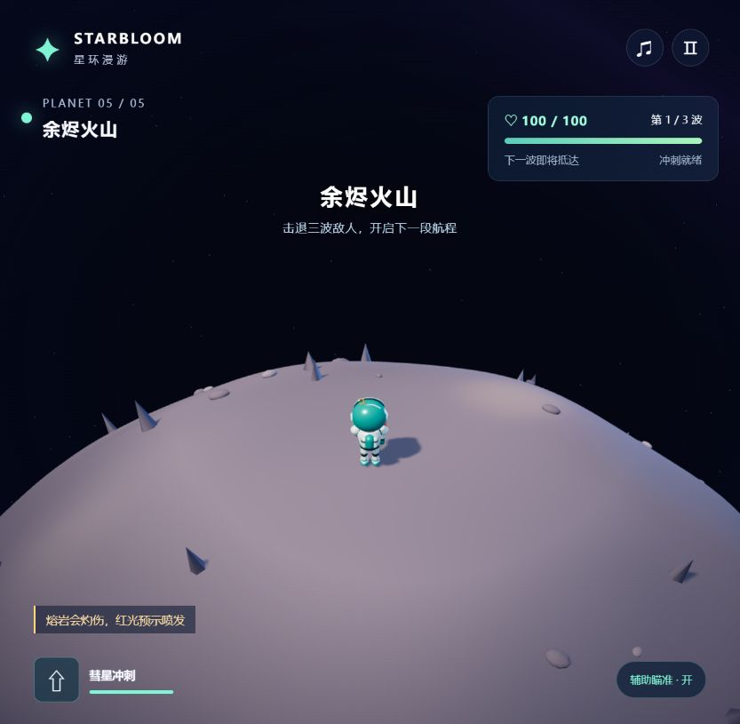


## 一笔，如何成为一个数字 · 手写识别动画

用手写数字 0–9，逐步演示图像识别的计算过程。77 秒时间线依次展示笔迹、灰度像素、二值化、卷积窗口、三维特征图、最大池化、模板比较与分类结果，讲解文字和公式跟随画面同步变化。

- [观看动画](https://shfzhangjian.github.io/AI_GTA/digit-recognition/) · [源码与操作说明](./digit-recognition/README.md) · [离线单文件版](https://shfzhangjian.github.io/AI_GTA/digit-recognition/digit-recognition.html)
- 支持数字切换、播放与暂停、逐步前后切换、拖动进度、0.5–2 倍速和全屏；空格暂停，左右方向键切换步骤。
- SVG 绘制手写轨迹，Three.js 展开像素与特征层。全部计算来自当前笔迹；采用固定滤波器与十个手写模板，属于教学模型，相对分类分数不代表实际识别准确率。
- 包含本地 Three.js 与 MIT 许可，无外部资源请求。浏览器需支持 WebGL 2；可直接打开离线 HTML，也可由 GitHub Pages 静态托管。

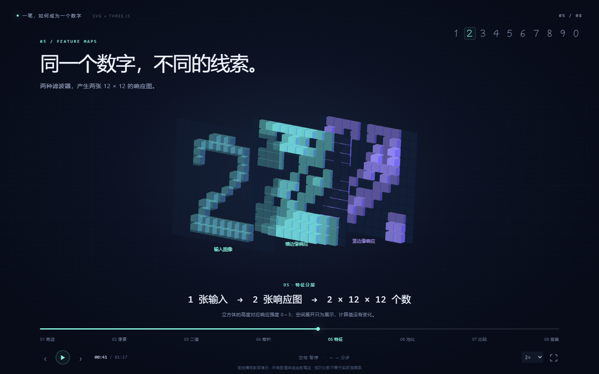

## 汇成上东 · 空间档案

从户型图进入一个可以自由浏览的家。墙体、门窗、家具和平面图共用图纸坐标；餐厅、厨房、主卧、书房、卫生间与入户门依据补充实拍还原主要布局、配色与生活细节。

- [在线浏览](https://shfzhangjian.github.io/AI_GTA/huicheng-residence/) · [项目与操作说明](./huicheng-residence/README.md) · [离线单文件](./huicheng-residence/汇成上东-离线预览.html) · [检查记录](./huicheng-residence/validation/model-report.json)
- 11 个空间、12 个导览视点，支持平面、3D 总览和第一人称游走；WASD 移动、拖动转向，E 或点击门扇开关门，包含墙体、家具和门扇碰撞。
- 图示总宽 14.44 m、总深 10.87 m、层高 2.77 m；支持墙体剖切、材质与光照切换、原图对照及 PNG 保存。最新修正保留无门通道，并清空书房床上的物品。
- GitHub Pages 和离线入口均内嵌程序、材质与图纸，打开即可使用；源码本地预览运行 `node server.mjs`。房间尺寸与细节按图纸比例及照片估算，用于空间浏览。

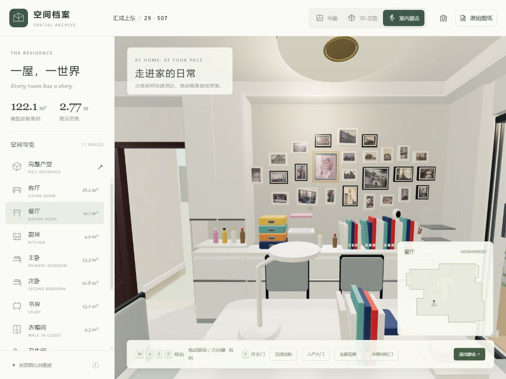

## 遗物猎场 · RELIC FIELD

在沉没庭院、失火铸坊和无声书库探索旧世界，手动瞄准攻击、闪避危险区、释放猎人技能，把武器、遗物与故事带回营地。10 名角色可搭配 24 把武器，40 件遗物按余烬、霜晶、雷鸣、菌蚀、回响和钢铁六个系列形成 3 件 / 6 件组合。

- [在线试玩](https://shfzhangjian.github.io/AI_GTA/relic-hunters/) · [源码与启动说明](./relic-hunters/README.md) · [游戏设计](./relic-hunters/docs/GAME_DESIGN.md) · [完整内容图鉴](./relic-hunters/docs/CONTENT_CATALOG.md)
- 9 个连续房间、3 位机制不同的 Boss、随机守卫与宝箱奖励；升级选遗物、秘匣换武器，8 种补给支持治疗、冻结、爆炸与增伤。发现记录永久保存；通关归档全部碎片，中途倒下或撤退保留 40%。
- WASD / 方向键移动，鼠标瞄准与按住左键攻击，空格闪避，E 技能，Q 补给，F 秘匣 / 前进，Esc 暂停。手机提供方向、自动瞄准攻击与技能按钮。
- 原生 Canvas 2D + ES Module + WebAudio，40 张原创像素精灵图使用八方向、八帧与固定脚底锚点，武器独立绘制；无外部素材请求、无需构建，可由 GitHub Pages 静态托管。Scenario MCP 未连接，当前素材由程序绘制，正式动画配置与离线请求模板随 [美术管线说明](./relic-hunters/docs/ANIMATION_PIPELINE.md) 提供。
- [14 项规则、浏览器完整路线、正常首房间战斗与手机布局验证](./relic-hunters/docs/QA.md)。本地运行 `cd relic-hunters && npm start`，或 Windows 双击 `relic-hunters/开始游戏.cmd`；浏览器打开 <http://127.0.0.1:8731/>。

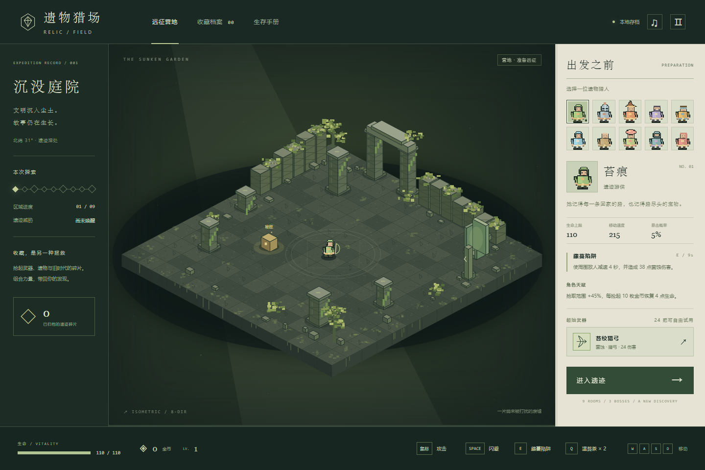

## 霓城突围 · 中文跑酷射击

自动奔跑并射击前方怪物，左右选择增益门强化武器，躲避路障，再挑战巨型绿色首领。三位中文英雄林墨、苏晴、陈龙各有独立技能与初始数值，包含六章解锁、星级成绩、本地存档和通关后的无尽模式。

- [在线试玩](https://shfzhangjian.github.io/AI_GTA/neon-breakout/) · [源码、操作与启动说明](./neon-breakout/README.md) · [验证记录](./neon-breakout/VALIDATION.md) · [角色展示](https://shfzhangjian.github.io/AI_GTA/neon-breakout/src/character-preview.html)
- Windows 安装 Node.js 20 或更新版本后，双击 `neon-breakout/启动游戏.cmd`，或在该目录运行 `npm start`，打开 <http://127.0.0.1:5199/>。无需安装 npm 运行依赖或构建，也可直接由 GitHub Pages 托管。
- A / D 或方向键移动、空格跳跃、E 释放英雄技能、Esc / P 暂停；手机提供拖动与触屏按钮，射击自动瞄准。蓝绿门补给和强化，红门扣弹药；首领重击与冲击波需要躲避。
- 使用本地 Three.js、程序生成的角色网格与材质、WebAudio 合成音效。最新人物包含卷发、黑色连帽运动装、条纹裤与白鞋，首领包含宽肩、大肚子和破损紫衣；根据参考视频重建外观，并非原视频的源模型。
- 31 项规则与完整六章流程测试通过，另有桌面、手机操作与首领战浏览器检查，记录随源码提供。

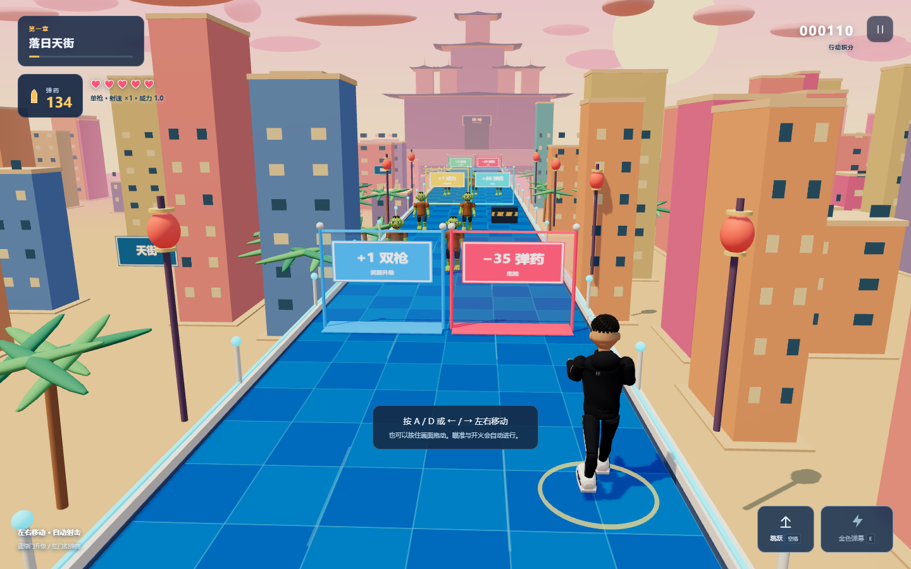

## 落日协议 · SUNFALL

空降落日群岛，与 11 名 AI 对手搜刮装备、交战并躲避持续收缩的风暴。海岛包含可进入建筑、屋顶楼梯与补给点；手枪、突击步枪和精确步枪各有不同的伤害、射速、后坐力与装填行为。

- [源码、操作与启动说明](./sunfall/README.md) · [本地验证记录](./sunfall/VALIDATION.md) · [第三方角色来源](./sunfall/THIRD_PARTY_ASSETS.md)
- Windows 安装 Python 3 后双击 `sunfall/start-game.cmd`，或运行 `python start_local.py`；打开 <http://127.0.0.1:4177/> 后点击「空降战区」。Three.js 与材质已包含，无需安装 npm 依赖或构建。
- WASD 移动、鼠标转向与开火、E 开伞 / 搜刮、R 换弹、Q 治疗、M 地图、Esc 暂停；手机提供触屏控件。
- 角色素材按源码包方式单独从官方来源获取并校验，首次启动需要联网。此子目录提供本地运行源码；GitHub Pages 不会自动执行 Python 素材获取脚本。
- 已在真实本地浏览器验证主菜单、空降、自动落地、AI 交战与暂停；浏览器运行错误日志为空。

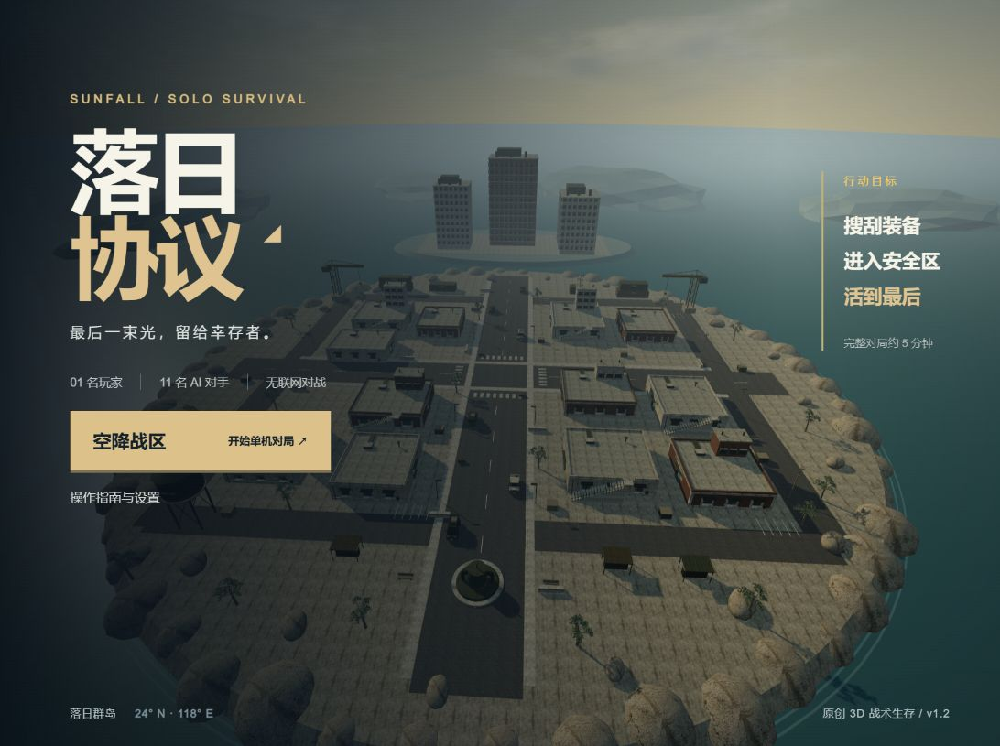

## 潮屿 · TIDELANDS

在云海中的热带浮岛驾驶小船，寻回散落的 8 颗珍珠，再用它们点亮木屋码头、龙骨瀑布、望海灯塔与肋骨珊瑚庭。场景参考 Sonia 的热带箱庭视频独立重建，并增加完整的寻宝与修复通关流程。

- [在线试玩](https://shfzhangjian.github.io/AI_GTA/tropical-island/) · [源码、玩法与启动说明](./tropical-island/README.md) · [验证记录](./tropical-island/qa/verification.json)
- 点击海面或珍珠自动航行，WASD / 方向键驾驶；拖动旋转、滚轮缩放，支持手机触控。进度保存在当前浏览器，可暂停、续玩和重新开始。
- 程序生成恐龙头骨、牙齿、肋骨拱廊、木屋、栈桥、棕榈、叶片与火山；自定义 GLSL 绘制海面焦散、云海、瀑布和浪花。所有运行资源随目录提供，无需构建或远程服务，可直接由 GitHub Pages 托管。
- 晴日 / 暮色切换、自动环绕、PNG 拍照及默认关闭的合成环境音。游戏规则测试和浏览器完整收集 / 修复流程通过，并验证了存档恢复、手机布局及图片下载。

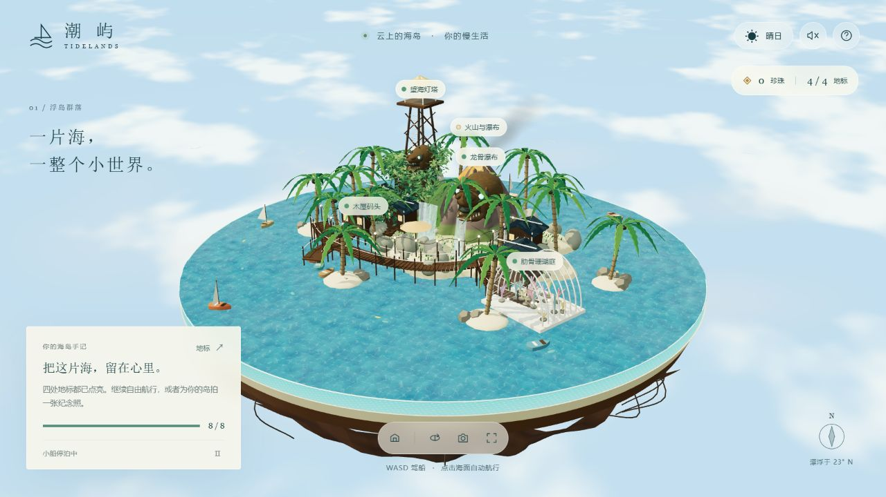

## 魔方实验室 · Cube Atelier

一个可以自由练习和逐步跟随指导的三阶魔方工作台。拖动观察 3D 魔方，或切换到平面展开视图；六个面实时同步，当前转动面、方向和公式记号都有对应说明。

- [在线体验](https://shfzhangjian.github.io/AI_GTA/cube-atelier/) · [源码入口](./cube-atelier/index.html) · [操作与运行说明](./cube-atelier/README.md)
- 支持 10 / 20 / 30 步打乱、按钮与键盘人工转动、撤销重做、计时与本地练习保存；每次打乱的公式可以复制。
- 指导模式根据当前状态求解，可单步执行或连续演示；人工转错后重新规划。公式手册提供六组常用公式的说明和独立示例，退出演示后恢复原练习。
- Three.js、cubejs 与字体均随项目提供，零构建，无外部资源请求，可通过 GitHub Pages 静态托管；桌面和手机均已适配。
- 已验证 1,518 次独立色块对照、12 个随机状态求解，以及浏览器中的视图同步、指导纠错、完整还原、演示恢复和手机操作，详见 [验证记录](./cube-atelier/VALIDATION.md)。

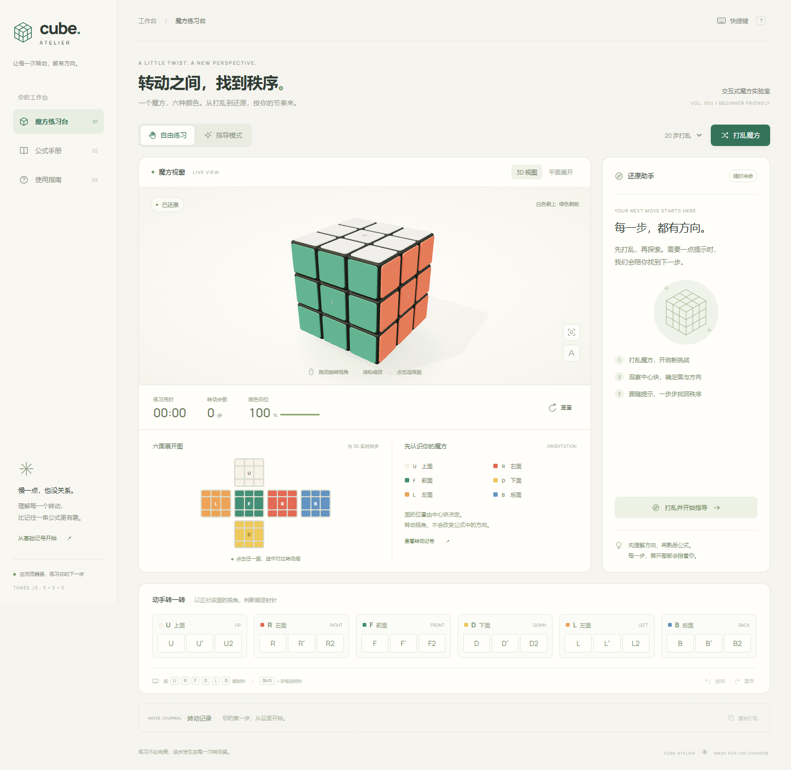

## 叶间微光 · Leaflight

带着一只叶帽小精灵探索等角像素森林，收集十二颗星露，躲避游荡的暗影菇，再回到树心祭坛点亮森林。

- [在线试玩](https://shfzhangjian.github.io/AI_GTA/leaflight/) · [源码、玩法与运行说明](./leaflight/README.md) · [验证记录](./leaflight/VALIDATION.md)
- WASD / 方向键移动，点击空地自动寻路；空格冲刺期间无敌，并能击晕暗影菇。三格生命、收集进度、冷却提示、暂停与重开，支持手机方向按钮和触屏冲刺。
- 原生 JavaScript + Canvas 2D + WebAudio，场景与音效由程序生成；叶帽角色采用本地四向透明 PNG。零依赖、零构建、无外部素材请求，可以直接打开 HTML 或通过 GitHub Pages 游玩。

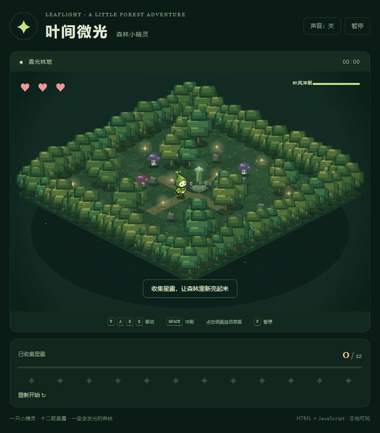

## 柑橘果冻 · Citrus Jelly

一棵可以抓住、摇晃和摘果的软糖柑橘树。琥珀色树干局部弯曲，宝石绿叶片透光，28 枚果实在枝梢上摆动；成熟果实随摇晃掉落，撞击时压扁与回弹，落果可捡起再次投掷，空茎随后逐渐结出新果。

- [在线体验](https://shfzhangjian.github.io/AI_GTA/citrus-jelly/) · [独立 HTML](./citrus-jelly/index.html) · [操作与源码说明](./citrus-jelly/README.md)
- 原生 WebGPU / WGSL，GPU 枝条蒙皮、实例化几何、4× MSAA、顺序无关透明合成；解析果实厚度、颜色吸收、程序化果皮与果瓣膜、屏幕空间折射。
- 柑橘、柚子、血橙三组配色；硬度、内部阻尼、成熟度、暂停与重置；鼠标和触摸抓取，有限环绕与缩放，手机底部面板默认折叠。
- 单文件、零依赖、零构建、无外部素材请求，可离线打开。已验证重复摇晃与再生、强拉、摘取与投掷、碰撞、休眠及手机交互，详见 [验证记录](./citrus-jelly/VALIDATION.md)。


## 果冻骰子 · Jelly Dice

温暖纸质摄影棚里，六种宝石色的软糖骰子落在磨砂玻璃托盘上。轻拉会拉长果冻，继续拉可提起移动；轻触会压出小凹陷，整个骰子随后摇晃并稳定。掷骰后按实际朝上的面读取各枚点数与总和。

- [在线体验](https://shfzhangjian.github.io/AI_GTA/jelly-dice/) · [独立 HTML](./jelly-dice/index.html) · [操作与源码说明](./jelly-dice/README.md)
- 每枚骰子包含 125 个模拟节点和 384 个四面体；XPBD 体积约束、共旋弹性、应变限制、摩擦接触与静止休眠。支持 1–5 枚骰子、鼠标抓取、触屏轻戳和双指缩放。
- 原生 WebGPU / WGSL，GPU 形变法线、五层屏幕空间折射、厚度吸收、皮下象牙色点数、彩色软阴影和 4× MSAA。单文件内嵌字体，无运行依赖或外部资源请求；无法使用 WebGPU 时显示说明卡片。
- 软硬度、摇晃衰减、¼速度、晶格显示、默认关闭的合成音效、暂停与重置。已完成桌面、手机、反转恢复、最大软度碰撞、稳定休眠及键盘验证；测试机器五枚运动骰子约 69 FPS，详见 [验证记录](./jelly-dice/VALIDATION.md)。

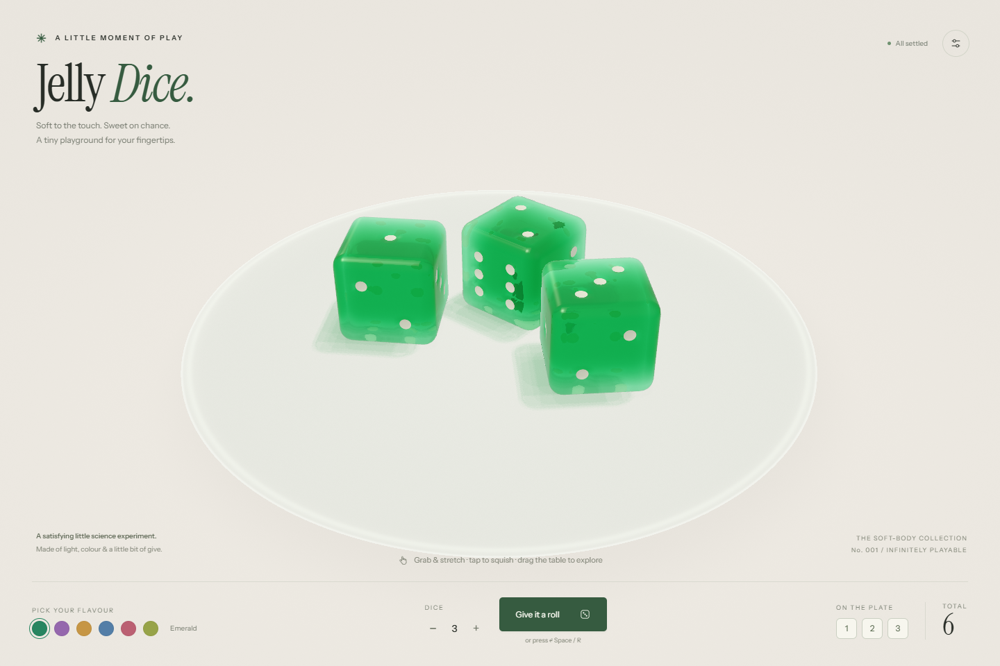

## 气球测试 · The Balloon Test

向一只乳胶气球泵气，看看它的极限。温暖纸质工作室、木柄地板泵、0–8 kPa 压力表与固定铬制喷嘴；气球从瘫软的囊袋逐渐充盈、变薄，最终从随机弱点实时撕裂。

- [在线试玩](https://shfzhangjian.github.io/AI_GTA/balloon-test/) · [独立 HTML](./balloon-test/index.html) · [操作与源码说明](./balloon-test/README.md)
- 轻触页面或 Space 泵气，F 轻弹，W 切换水模式，R 重置，S 在爆破后以 ×12 慢动作重播；个人最佳保存在当前浏览器。
- Gent 薄膜压力曲线、双面 Beer–Lambert 乳胶透射、独立印刷与署名层、程序化声音；水模式加入折射内层、水滴、水洼与湿痕。形变、碎片和液体运动采用实时视觉近似。
- 单文件内联 Three.js，无外部图片、模型、音频或脚本；仅字体可选联网。已验证手机横竖屏、空气与水的确定性重播，以及 1,000 个随机种子的压力曲线，详见 [验证记录](./balloon-test/QA.md)。


## 果冻西瓜 · Melon Jelly

一片可以抓住、拉伸、抬起和轻轻扭转的西瓜果冻。红宝石果肉、浅色内皮与条纹绿皮共同变形，两面的 28 颗种子始终随曲面移动；释放后自然摇晃并逐渐稳定。

- [在线体验](https://shfzhangjian.github.io/AI_GTA/melon-jelly/) · [独立 HTML](./melon-jelly/index.html) · [操作说明](./melon-jelly/README.md)
- 原生 WebGPU / WGSL 渲染，四面体 XPBD 软体与体积保持约束，支持鼠标抓取、触屏与双指扭转。
- 三组配色、硬度、内部阻尼、轻推、重置、¼速度、显示网格和暂停；手机控件位于画布下方。
- 单文件、零依赖、无需编译，可离线打开；需要支持 WebGPU 的浏览器和可用 GPU。39 项浏览器检查及三种硬度静置测试通过，详见 [验证记录](./melon-jelly/VALIDATION.md)。

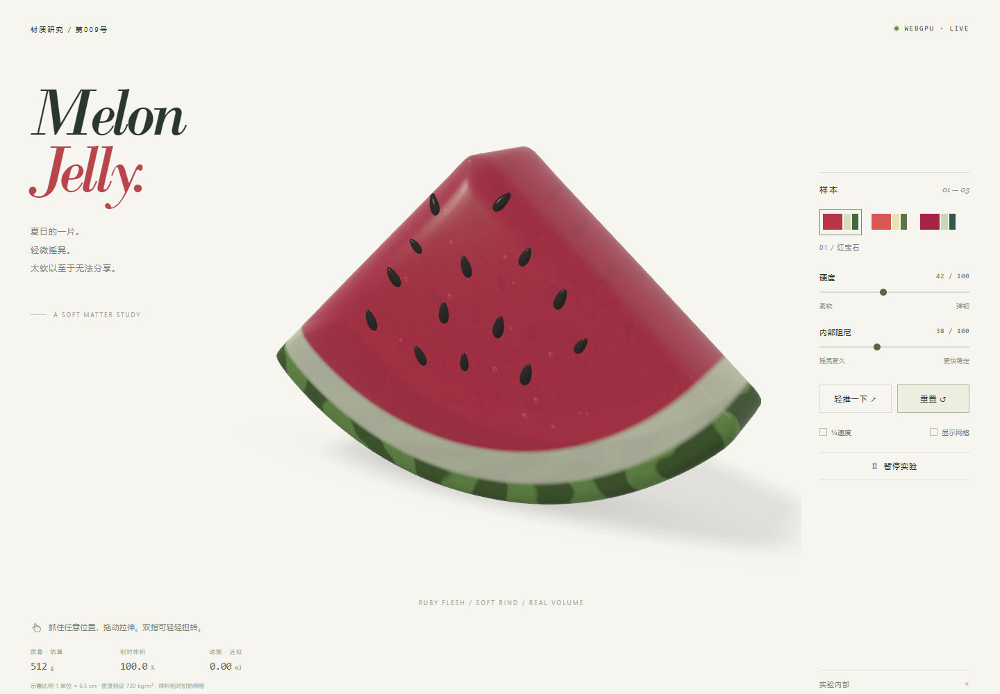

## 摧毁任意网页 · Pixel Lab

把网页变成可破坏的像素关卡：十种武器、跳跃飞行、手雷和最多四人的房间对战。内置演示可直接体验；输入公开网址后，服务端通过 thum.io 获取截图并生成关卡。

- 本地地址：<http://127.0.0.1:8787/>。Windows 完成首次安装与数据库初始化后，可双击 `pixel-destroy-lab/启动游戏.cmd`。
- 操作：A / D 或方向键移动，空格跳跃或长按飞行，鼠标射击，右键手雷，数字键切换武器，Esc 暂停；手机提供触屏按钮。
- 已验证：生产编译、类型检查、浏览器进入内置演示，以及本地房间创建、状态同步和退出。
- [完整安装与启动说明](./pixel-destroy-lab/README.md#本地运行) · [验证记录](./pixel-destroy-lab/docs/VERIFICATION.md) · [素材来源与版本差异](./pixel-destroy-lab/docs/PARITY.md)


## 漫步外滩 · 云端来信

把上海外滩做成一个可以自由散步的像素世界：江海关钟楼与画面上的上海时间逐秒同步，东方明珠、上海中心、环球金融中心和金茂大厦轮廓可辨；游船、行人、烟花、灯光与江面倒影持续变化。

- 无人机编队循环演绎「我 ♥ 上海」→ 东方明珠与江水轮廓 →「外滩 · 晚安」，每幕停留 9 秒、换阵 5 秒，底部开关可独立控制。
- 方向键 / WASD / 点击步道自由漫步，按 E 收藏四处观景点；手机提供触屏方向键，进度保存在当前浏览器。
- 可切换昼夜、雨晴、人流、烟花、灯光秀、无人机与环境音效；雨天人物撑伞，江面出现涟漪。
- 游戏场景全部由 SVG 动态绘制，环境音效由 WebAudio 合成，无需安装依赖或构建。

[在线试玩](https://shfzhangjian.github.io/AI_GTA/shanghai-bund/) · [源码与启动说明](./shanghai-bund/README.md)


## GitHub Pages 部署方式

仓库根目录 `index.html` 为导航落地页；Pages 采用 **Deploy from a branch → `main` / (root)**。上表提供 GitHub Pages 试玩链接的项目可按对应路径访问；需要构建的静态项目已随仓库提交发布产物。

`pixel-destroy-lab/` 提供完整源码，需要编译后启动本地 Wrangler 服务，或部署至 Cloudflare Workers。它的房间数据库和网页截图 API 无法由 GitHub Pages 静态托管运行，启动方法见该项目 README。

## 苔苔敲敲岛 · 连锁开采

点击相邻同类矿块，一锤连消；连消 5 块奖励蘑菇炸弹，8 块再送彩虹魔法。收齐青苔与晶石，探索五种主题小岛。支持手机触摸、双指缩放与放大后拖动，桌面可用 1 / 2 / 3 选择道具、P 暂停、M 静音。

- [在线试玩](https://shfzhangjian.github.io/AI_GTA/moss-mallet/) · [操作与源码说明](./moss-mallet/README.md)
- 检查：在 `moss-mallet/` 运行 `npm test`，覆盖四向连消、工具优先级、特殊砖接力及 500 轮随机消除后的棋盘完整性。


## Tilt Lab 倾斜实验室开发

进入 tilt-ball 目录，运行 npm ci 和 npm run dev；构建运行 npm run build，物理验证运行 node tools/verify-goal.mjs。dist/ 已提交，可直接通过 GitHub Pages 试玩，详细说明见 [项目 README](./tilt-ball/README.md)。

## 雨山湖夜游 · 无人机告白

保留金鹰双塔的红色灯光，使用动态 SVG 绘制标题、湖岸、人流、游船、无人机与湖面倒影。支持方向键 / WASD / 点击步道漫步，以及手机方向控制。

- [源码与操作说明](./yushan-lake-pixel/README.md)
- [48 秒 1080p MP4 成片](./yushan-lake-pixel/exports/雨山湖夜游-无人机告白.mp4)（24 fps，H.264 / AAC，原创合成环境音乐）
- [博文](./yushan-lake-pixel/exports/博文-把雨山湖的夜色做成像素游戏.txt) · [高清截图](./yushan-lake-pixel/exports/夜空告白.png) · [SVG 矢量截图](./yushan-lake-pixel/exports/夜空告白.svg)


