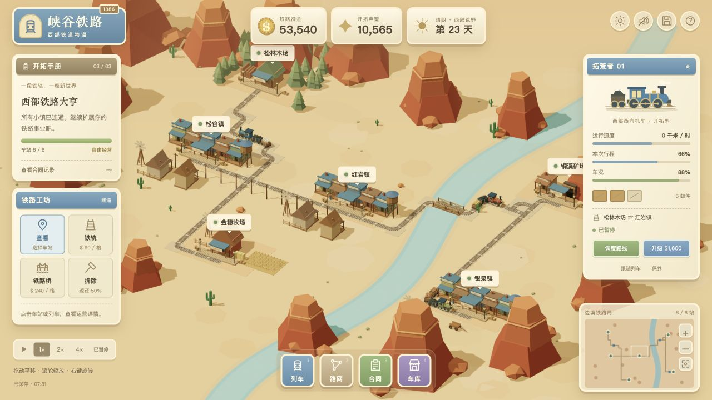

# 峡谷铁路 · 西部铁道物语

中文 3D 西部铁路经营游戏。参考 [Dilum Sanjaya 的铁路沙盘视频](https://x.com/DilumSanjaya/status/2086858760753201622)，独立重建沙漠小镇、低多边形蒸汽机车、铁路建造和经营界面；未使用原视频的代码、模型或贴图。

## 开始游戏

[在线试玩：峡谷铁路](https://shfzhangjian.github.io/AI_GTA/canyon-railway/)

本目录运行 `npm run dev`，打开 <http://127.0.0.1:8766/>。也可以使用任意静态文件服务器。无需安装 npm 依赖、编译或连接外部素材服务；所有 Three.js 文件均已随项目提供。请通过 HTTP 打开，直接双击 HTML 会被浏览器的 ES Module 安全限制阻止。

游戏从 6,800 金币、一段连接松谷镇与红岩镇的铁路和一列正在运营的火车开始。资金、路网、货物库存、车队和合同进度每 15 秒自动保存在当前浏览器，也可点击顶部保存按钮。

## 玩法

- **建造**：选择「铁轨」，依次点击起点车站 / 已有轨道和终点。绿色路线为预览，确认后扣款施工。陆地每格 60 金币；选择「铁路桥」可跨河，水上每格 240 金币。路线避让房屋、水塔、农田与大型岩柱。
- **调度**：打开「列车」→「调度路线」，选择两座已连通的车站。列车自动装载对方需要的货物、运输、结算和返程。不存在供需的路线无法启用。
- **合同**：将 12 份木材送到红岩镇、16 份粮食送到铜溪矿场、18 份铜矿送到银泉镇。合同需手动领取奖励。完成三份合同并将六站全部接通，获得开拓成功提示，之后可继续经营。
- **车队**：「车库」购买新车，最多 6 列；两次升级提升载货量和速度，保养恢复车况。车况低于 20% 时减速，降至 0% 时停止，需要保养。
- **拆除**：返还一半造价，车站轨道和运营路线受保护。

| 车站 | 出产 | 接收 |
| --- | --- | --- |
| 松谷镇 | 粮食 | 木材、铜矿 |
| 红岩镇 | 邮件 | 粮食、木材、铜矿 |
| 松林木场 | 木材 | 邮件 |
| 铜溪矿场 | 铜矿 | 木材、粮食、邮件 |
| 金穗牧场 | 粮食 | 邮件、木材 |
| 银泉镇 | 邮件 | 粮食、木材、铜矿 |

建议先把松林木场接到现有路网，安排「松林木场 ⇄ 红岩镇」双向运输，再向铜溪矿场延伸。

## 操作

鼠标拖动平移、滚轮缩放、右键拖动旋转；手机单指平移、双指缩放与旋转。点击小地图移动视角，点击列车可查看详情。

空格暂停 / 继续，数字 1–4 打开列车 / 路网 / 合同 / 车库，B 进入铺轨，H 打开说明，Esc 关闭面板或取消施工。支持 1× / 2× / 4× 速度、列车跟随、日暮切换和默认关闭的合成音效。打开经营面板时模拟暂停，关闭后继续。

## 技术与验证

Three.js 0.185.1 + 原生 JavaScript ES Modules + WebAudio。程序化生成所有场景、列车、货物、图标和音效；静态几何按材质合并，列车沿连续圆角轨道行驶，装载货物可见。

`npm test` 运行 11 项规则测试，包括实际运输收入、建筑避让、跨河费用、资金不足、运营轨道保护、调度限制、合同奖励、机车购买升级、暂停、全流程通关和存档校验。浏览器验证记录见 [VALIDATION.md](./VALIDATION.md)。

这是单人休闲经营版本：建造采用格点自动规划，列车按端点自动折返；未实现信号闭塞、会车调度和列车物理碰撞。所有进度仅保存在当前浏览器，不含云存档或多人联机。

Three.js 许可见 [vendor/LICENSE](./vendor/LICENSE)。
