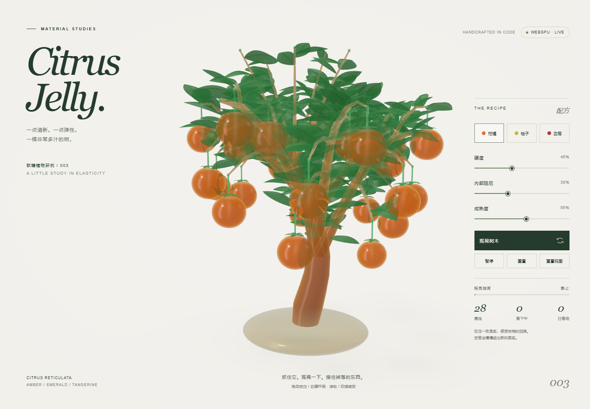

# 柑橘果冻 · Citrus Jelly

一棵完全由半透明软糖组成的微型柑橘树：琥珀色树干、宝石绿叶片与 28 枚悬挂的果冻柑橘。抓住枝条摇晃，拉下一枚果实，再轻甩抛出去。

**[在线体验](https://shfzhangjian.github.io/AI_GTA/citrus-jelly/)** · [独立 HTML](./index.html) · [验证记录](./VALIDATION.md) · [返回项目合集](../)



## 运行

`index.html` 包含全部 CSS、JavaScript、WGSL 与程序化几何，零依赖、零构建，没有外部模型、纹理、图片、字体或素材请求。用支持 WebGPU 且启用硬件加速的 Chrome 或 Edge 直接打开即可离线运行；没有 WebGPU 或可用 GPU 时会显示原因。

也可从本目录启动静态服务：

```bash
python -m http.server 8792 --bind 127.0.0.1
```

打开 <http://127.0.0.1:8792/>。远程托管使用 HTTPS；GitHub Pages 可直接运行。

## 操作

- 拖动树干、枝条或叶片：局部弯曲与摇晃；放手后回弹并逐渐稳定。
- 拉动悬果：枝梢先弯曲，果实断开后留在手中；轻甩松手即可投掷。落果可以捡起并再次投掷。
- 空茎约 9–12 秒后开始结出新果，随后约 5 秒逐渐长大。
- 拖动空白或右键拖动环绕；滚轮或双指缩放，俯仰和缩放范围受限。
- 面板可调整硬度、内部阻尼、成熟度，切换柑橘、柚子、血橙配色，以及摇晃、暂停、重置树木和重置视角。配色切换保留物理状态。
- 手机横竖屏均使用底部折叠面板，默认关闭。画布获得焦点时，空格暂停，S 摇晃，R 重置树木，0 重置视角。

## 实现

原生 WebGPU 与内嵌 WGSL：146 个树木骨架节点、437 片独立建模的折叠叶片、28 枚果实；GPU 枝条蒙皮，叶片、果实、短茎和花萼实例化，最终画面使用 4× MSAA。深度加权顺序无关透明合成处理叶片重叠；果实采用解析厚度、颜色吸收、程序化凹坑与果瓣膜、浅色果心、屏幕空间折射和摄影棚反射。内部散射、折射和柔和阴影是实时近似。

物理以固定 120 Hz 步长运行。树根固定，弯曲刚度随枝条半径变化，长度约束限制拉伸；悬果摆锤与枝梢双向耦合，运动变化引起的茎张力决定掉落。落果具有保持体积的冲击变形、碰撞、反弹、滚动和休眠；碰撞可唤醒稳定的果堆。

落果池上限 64，落叶池上限 32；超过 34 枚松散果实时，旧的稳定落果逐渐淡出。GPU 数据缓冲区反复使用；像素密度按帧耗时有界调节，最高 280 万渲染像素，最终 4× MSAA 与物理步长保持不变。
