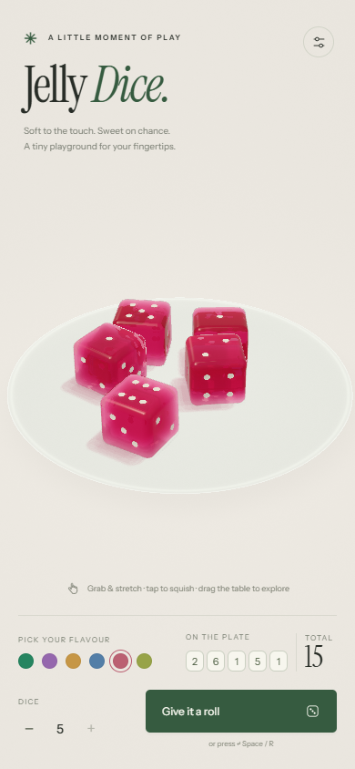
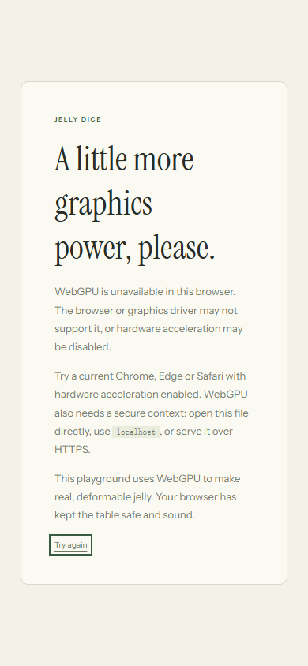

# Jelly Dice · 验证记录

2026-10-03 在 Windows 的 Chrome 原生 D3D11 WebGPU 后端中完成无头浏览器测试，桌面视口 1440×960、手机视口 390×844，并检查 320×740 窄屏。截图来自实际应用渲染。

## 验证结果

| 检查 | 结果 |
| --- | --- |
| 桌面运行、嵌入字体、设置与六种配色 | 通过，无外部运行资源请求 |
| 轻戳、渐进抓拉、贴底拉伸、提起与释放 | 通过，释放速度受限 |
| 五枚掷骰、点数结算、休眠 | 全部进入休眠；休眠节点经过 60 个模拟步仍逐值完全相同 |
| 完整晶格镜像反转 | 360 步后恢复，最小四面体有符号体积 / 静止体积约 0.982 |
| 最大软度、刻意重叠碰撞 | 测得最大边长 / 静止边长 1.47995，体积保持正值，最终全部休眠 |
| 倾斜堆叠与平放堆叠 | 均能稳定；平放上层骰子中心高度约 1.784，未穿透到托盘 |
| 六个固定随机种子的五枚掷骰 | 全部在 4.8–6.6 秒模拟时间内休眠，额外 120 步节点完全不变 |
| 静止邻居、最多两次歪斜修正、暂停 | 通过 |
| 手机布局、双指缩放、键盘轻戳与 R 掷骰 | 通过，无水平溢出 |
| 直接 file:// 打开、WebGPU 缺失说明卡片 | 通过 |
| JavaScript 异常与 WebGPU 验证错误 | 未发现 |

最终交互测试中五枚运动骰子约 **69 FPS**；20 个物理步共约 **69 ms**（约 3.45 ms / 步，120 Hz 模拟）。该数值仅代表测试机器，帧率取决于 GPU、浏览器与视口。渲染像素上限为 140 万。

原始数据：[交互测试](./validation/qa.json)、[物理压力测试](./validation/stress.json)、[重复掷骰](./validation/settling.json)、[性能与窄屏检查](./validation/performance.json)。性能报告来自同一渲染器、最终接触物理微调之前；最终运动帧率以交互测试报告为准。重复掷骰检查促使邻居唤醒改为依据整体移动、旋转或正在抓拉，避免局部约束振动反复重置休眠计时。

## 重跑

按照 [README](./README.md#headless-validation) 安装可选测试依赖、启动本地服务，然后运行 `node tests/qa.mjs`、`node tests/stress.mjs` 和 `node tests/settling.mjs`。最后一项使用六个固定随机种子反复掷出五枚骰子，检查休眠、节点稳定性、正体积、应变上限与歪斜修正次数。脚本断言失败时返回非零退出码，输出截图与 JSON 到 `artifacts/`。测试依赖不参与应用运行。

光学采用五层屏幕空间折射，屏幕外物体与多次内部反射不参与追踪；玻璃托盘为程序化着色近似。

