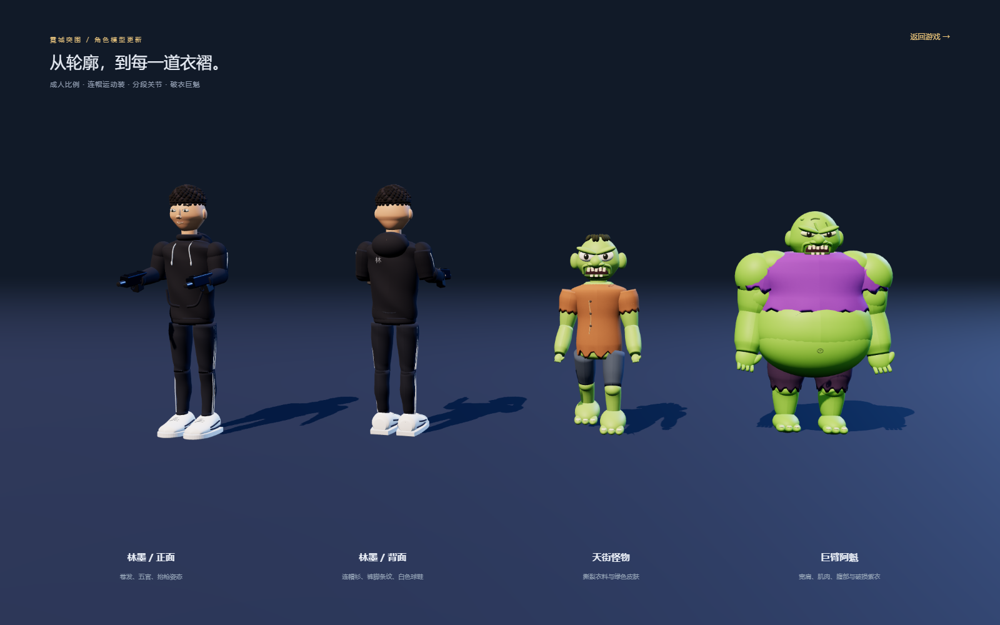

# 霓城突围

根据用户提供的 15 秒视频实现的中文 3D 跑酷射击游戏。核心循环为：自动奔跑 → 左右移动射击怪物 → 选择增益门 → 升级武器 → 巨型首领战 → 结算与解锁。

使用 Three.js、原生 JavaScript ES Modules、HTML/CSS 和 Node.js 静态服务。所有依赖、美术模型、文字纹理和音效都在本地；运行时不需要外网。界面与游戏角色直接根据视频和用户要求自行设计。

[在线试玩](https://shfzhangjian.github.io/AI_GTA/neon-breakout/) · [角色模型展示](https://shfzhangjian.github.io/AI_GTA/neon-breakout/src/character-preview.html) · [验证记录](./VALIDATION.md)


## 开始游戏

Windows 双击 **启动游戏.cmd**，或者在本目录执行：

```powershell
npm start
```

打开 <http://127.0.0.1:5199/>。需要 Node.js 20 或更新版本，以及支持 WebGL 2 的现代浏览器；不需要执行 npm install。

同一局域网的手机可以访问 `http://电脑的局域网IP:5199/`。手机和电脑需在同一网络，系统防火墙需允许此端口。游戏服务监听本机所有网卡。

## 操作

| 操作 | 电脑 | 手机 |
|---|---|---|
| 左右移动 | A / D 或 ← / →，也可以按住画面拖动 | 在画面上左右拖动 |
| 射击 | 自动瞄准附近前方目标并开火 | 自动开火 |
| 跳跃 | 空格，或点击跳跃按钮 | 点击跳跃按钮 |
| 英雄爆发 | E，或点击技能按钮 | 点击技能按钮 |
| 暂停 / 继续 | Esc / P，或右上角按钮 | 右上角按钮 |

选择门的左半边或右半边获得相应效果，正中央按最近的一侧判定。蓝绿门补给或强化，红门扣除弹药。路障和怪物会造成伤害，跳跃可躲避路障。首领重击会提前标出红色区域，冲击波必须跳跃躲避。

## 实现内容

- 三位原创中文英雄：林墨（均衡弹幕）、苏晴（火力爆发）、陈龙（爆发护盾），拥有独立模型配色、角色介绍和初始数值。
- 六个循序解锁的章节：落日天街、灯影长桥、青岚街区、云端集市、赤霞城门、霓城之巅。每章约 30～60 秒，均有怪物队列、门、路障、补给与首领。
- 原创 3D 角色：成人头身比例、短卷发、连帽运动装、裤脚条纹、鞋带、中文背绣、独立手指与分段关节。环境为蓝色高架赛道、城市楼群、灯笼、棕榈和中国式城楼。
- 自动射击、真实弹道、单双枪及三连弹、射速/威力升级、弹药消耗、击退怪物、连击与积分。
- 巨型绿色首领、实时血条、移动、蓄力重击、冲击波和投射物；弹药耗尽时提供应急补给以继续战斗。
- 英雄能量积累、4 秒爆发、穿透弹、跳跃、受击无敌时间和屏幕反馈。
- 3 秒准备倒计时、暂停恢复、胜负结算、重新挑战、章节解锁、星级成绩、通关后无尽挑战。
- 本地保存英雄、解锁章节、最高积分、星级、最佳用时及设置。
- 手机触屏与电脑键盘，音效开关、画面品质和全屏设置；切换到后台自动暂停。
- 合成射击/受击/升级音效与简短行动节拍，不使用外部音频文件。

章节使用同一套城市与擂台场景，改变怪物数量、血量、跑道长度、速度和首领难度。角色与场景是原创卡通程序化模型，视觉不宣称与参考视频逐像素一致。本交付是浏览器游戏；不包含 App Store 上架包。

## 构建与验证

```powershell
npm run check
npm test
npm run build
node server.mjs --dist
```

`dist/` 是可以放在任意静态服务器上的离线完整文件。不要直接双击 index.html：浏览器会限制 file:// 下的 ES Module 加载。

31 项规则测试覆盖：关卡生成、三位角色、左右选择门、弹道与穿透、生命与无敌时间、跳跃、技能、首领攻击、应急补给、胜负、重开、无尽模式，以及三位英雄分别通过六章的完整流程。完整通关控制器只使用移动、跳跃和技能，没有增加生命、弹药或伤害。

真实 Chromium 测试覆盖桌面与 390×844 手机视口、键盘和触屏移动、暂停冻结、跳跃与技能、首领渲染、结算、解锁和刷新后存档。发布的检查记录在 `qa/`，重新运行测试产生的记录和截图在 `artifacts/`。

`scripts/browser-check.mjs` 与 `scripts/capture-models.mjs` 需要 `puppeteer-core` 与 Chrome，仅供开发测试。可先执行 `npm install --no-save --package-lock=false puppeteer-core`，并用环境变量 `CHROME_PATH` 指定 Chrome 可执行文件；Windows 默认查找 `C:/Program Files/Google/Chrome/Application/chrome.exe`。也可用 `PUPPETEER_PATH` 指定已有的 puppeteer-core 安装位置，用 `GAME_URL` 指定含子目录的测试网址（默认 `http://127.0.0.1:5199/`）。游戏运行不依赖这些测试工具。`?test=1` 在本地开发时提供自动化测试接口，正常 URL 不提供这个接口。

## 代码结构

- `src/data.mjs`：角色、关卡和增益门数据。
- `src/game.mjs`：不依赖画面的游戏模拟与碰撞规则。
- `src/render.mjs`：场景、粒子和跟随摄像机。
- `src/characters.mjs`：曲面角色建模、布料与皮肤材质、关节动作、模型复用和远处怪物简化。
- `src/app.mjs`：页面流程、交互、存档与 HUD。
- `src/audio.mjs`：Web Audio 合成音效。
- `vendor/`：随游戏分发的 Three.js（MIT 许可证见 THREE-LICENSE.txt）。

本地记录保存在浏览器 localStorage 中，同一浏览器和网址下有效，电脑和手机之间不会自动同步。系统不支持全屏时会显示提示；无可用 WebGL 时显示明确的启动错误。

## 角色第二版

按参考视频重建了角色外观，主角改为短卷发、黑色连帽衫、黑色条纹运动裤和白色球鞋；保留中文姓名与背部刺绣。苏晴和陈龙使用同等级角色结构，分别搭配赤色和青色运动装。首领取消头冠，改为秃头、宽肩、粗壮手臂、暴露腹部和破损紫衣，加入更接近参考的愤怒五官、指节与脚趾。

角色展示页：[在线查看](https://shfzhangjian.github.io/AI_GTA/neon-breakout/src/character-preview.html)，本地启动后访问 <http://127.0.0.1:5199/src/character-preview.html>。新角色为根据画面制作的原创网格，视频未提供原始三维文件，所以不宣称与视频使用完全相同的模型。


