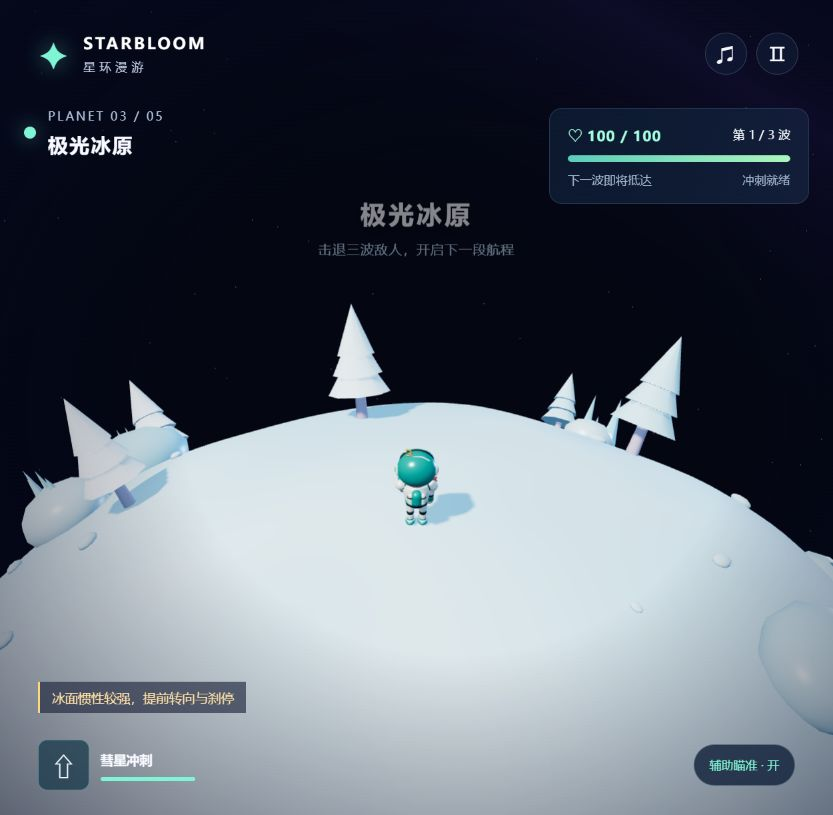
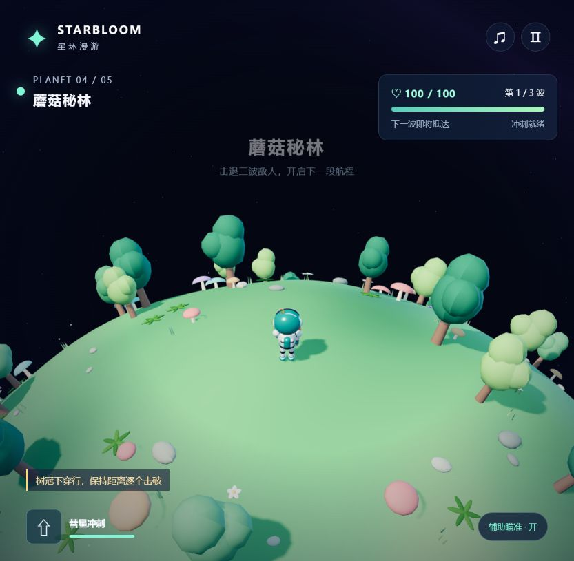

# 沿着星球的弧线奔跑：星环漫游 STARBLOOM

《星环漫游 · STARBLOOM ODYSSEY》是一款原创 3D 球面重力射击肉鸽。控制小宇航员贴着球面奔跑，镜头跟随当前位置转动，在五颗小星球之间作战、强化，再飞向下一站。

**[✦ 在线试玩](https://shfzhangjian.github.io/AI_GTA/starbloom/)** · **[🎬 观看中文介绍视频](https://shfzhangjian.github.io/AI_GTA/starbloom/blog.html)** · [下载 MP4](https://shfzhangjian.github.io/AI_GTA/starbloom/media/starbloom-introduction.mp4)

## 三波战斗，一次选择

每颗星球有三波敌人，包含追击甲虫、远程花炮和冲锋重甲。持续射击、保持距离，并在危险时用彗星冲刺穿过敌群。默认辅助瞄准锁定附近目标，也能关闭后用鼠标瞄准。

净化星球后回复 18 生命，再从三项随机强化里选择一项。八项强化覆盖伤害、射速、散射、生命、冲刺、击杀回复、贯穿和移动速度；可叠加，并持续保留到本局结束。选择下一个未清理的目的地，经历约 4.6 秒的星际飞行，继续冒险。五颗星球全部完成后获胜。

## 五颗星球，五种风景

花海星原适合熟悉球面移动和射击；碧波环岛有河道、沙洲与木桥；极光冰原的惯性较强，需要提前刹停；蘑菇秘林布满圆冠树木与菌菇；余烬火山的熔岩与火山口会造成接触伤害。

## 操作与启动

WASD / 方向键移动，鼠标左键 / 空格持续射击，Shift 冲刺，Q / E 转动镜头，Esc 暂停，M 切换音效；开始航程后默认有声，右上角「音量」分别调节战斗音效和星球环境音，设置会保存在当前浏览器。手机有触屏摇杆、射击与冲刺按钮，推荐电脑体验。

需要支持 WebGL 2 的现代浏览器。游戏自带 Three.js，无需后端、API 密钥或构建。下载源码后运行 `npm start`，访问 `http://127.0.0.1:8093/`。

## 这段视频如何制作

视频来自实际浏览器的 WebGL 游戏画面，由自动操作按正常规则完成五球、十五波和 150 次击破。完整录制约 200 秒，剪成约 150 秒，并加入状态叠层、中文合成旁白和中文字幕。动态战斗保持正常速度，部分界面延长停留用于讲解。文中的截图保留原始游戏界面。视频与截图录于音乐升级前；当前试玩版已加入 14 种原创音效、5 种星球环境音与独立音量控制。

[打开视频与图文介绍页](https://shfzhangjian.github.io/AI_GTA/starbloom/blog.html) · [完整源码](https://github.com/shfzhangjian/AI_GTA/tree/main/starbloom) · [验证记录](./VALIDATION.md)
