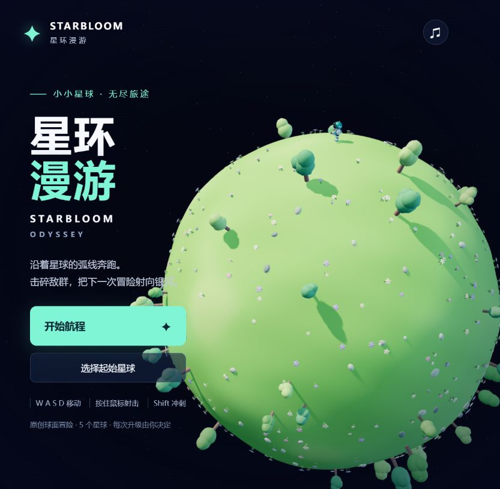

# 星环漫游 · STARBLOOM ODYSSEY

原创 3D 球面重力射击肉鸽：控制小宇航员在五颗小星球间移动、射击、获得随机强化，清理全部星球后获胜。

**[✦ 在线试玩](https://shfzhangjian.github.io/AI_GTA/starbloom/)** · **[🎬 中文视频与博文](https://shfzhangjian.github.io/AI_GTA/starbloom/blog.html)** · [介绍视频 MP4](./media/starbloom-introduction.mp4) · [博文 Markdown](./BLOG.md)



## 本地运行

需要 Node.js，浏览器需要支持 WebGL 2。无需安装 npm 依赖、API 密钥、后端或构建。

```bash
cd starbloom
npm start
```

打开 http://127.0.0.1:8093/ 。也可以在本目录使用 `python -m http.server 8093 --bind 127.0.0.1`。直接双击 HTML 可能受 ES Module 安全策略限制，请使用 HTTP 服务。Three.js 已随源码提供。

## 操作

| 操作 | 按键 |
| --- | --- |
| 沿球面移动 | WASD / 方向键 |
| 持续射击 | 按住鼠标左键 / 空格 |
| 彗星冲刺，短暂无敌 | Shift |
| 转动镜头 | Q / E |
| 暂停或继续 | Esc |
| 切换音效，首次开始默认开启，保存静音选择 | M |
| 分别调节战斗音效与星球环境音 | 右上角「音量」 |

默认开启辅助瞄准，可通过右下角按钮关闭并用鼠标指向地面瞄准。手机提供左侧摇杆和右侧射击 / 冲刺按钮；电脑体验优先。

## 航程与强化

花海星原、碧波环岛、极光冰原、蘑菇秘林和余烬火山，每颗星球三波敌人。完成一球后回复 18 生命，从三项随机强化中选一项，再跳往未清理的星球。八项强化可叠加：伤害、射速、散射、生命上限与治疗、冲刺冷却、击杀回复、贯穿、移速。五球完成后胜利，失败后可重新开始；星图支持选择任意起点。

敌人有追击甲虫、远程花炮和冲锋重甲。冰面惯性更强；熔岩和火山口有接触伤害。花草树木为装饰，不是射击掩体。

## 文件与部署

- `index.html`、`style.css`：中文游戏界面。
- `game.js`：场景、镜头、输入、加载生命周期和音效事件派发。
- `audio.js`：原创 PCM 合成、Web Audio 音效与五种星球环境音、音量和静音设置。
- `core.js`：球面运动与战斗模拟。
- `worlds.js`、`actors.js`：五种程序化星球、宇航员与三类敌人。
- `vendor/`：本地 Three.js 和 MIT 许可。
- `tests/`：模拟、音频与应用集成测试。
- `audio-preview/`、`AUDIO-QA.md`：离线声音试听生成脚本与音频设计验证说明。
- `blog.html`、`BLOG.md`、`media/`：介绍页、博文、约 150 秒 720p MP4、字幕、章节和截图。
- `source-original.zip`：本次上传的音乐升级完整源码包，保留原始目录结构。
- `video-production/`：录制与剪辑脚本、介绍稿和生产说明。

发布时将原包的 `dist/` 内容放在本目录，测试的相对导入路径随之调整；游戏模块本身与上传源码一致。入口和所有资源均为相对路径，可部署到 GitHub Pages 子目录。

## 验证

```bash
npm test
```

10 项模拟测试、16 项音频测试、3 项音频冒烟测试和应用集成测试均通过。集成测试使用 DOM / 渲染器桩，浏览器实机另行验证：真实 WebGL 画面正常，自动操作完成五球、150 次击破和四次星际跳跃；详见 [验证记录](./VALIDATION.md)。

## 音乐与音效升级（2026-10-03）

开始航程时通过用户手势解锁声音，新用户默认有声。14 种战斗与航程音效、5 种星球环境音均由代码合成。右上角「音量」可以分别调节战斗音效和环境音，M 键切换静音；设置保存在当前浏览器。暂停、切到后台和静音会立即停止声音，恢复时只启动一个环境循环。

音频引擎限制同时播放的声部数量，并使用压缩器控制峰值。`npm run audio:preview` 可在 `audio-preview/` 生成两份 WAV 试听；离线合成不替代实际浏览器或扬声器试听。

本次更新游戏代码和音频说明。现有介绍视频与截图录于音乐升级前。

## 资源与视频说明

宇航员、敌人与星球均由代码生成；未使用任天堂角色、模型、音乐或贴图。Three.js 使用 MIT 许可。

视频为浏览器实机帧和自动操作演示，叠加讲解用状态界面、中文合成旁白与中文字幕。截图保留原始游戏界面。旁白由 zh-CN-YunxiNeural 合成。
